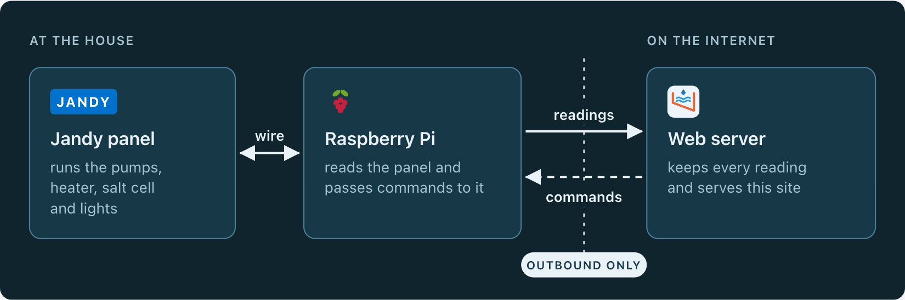

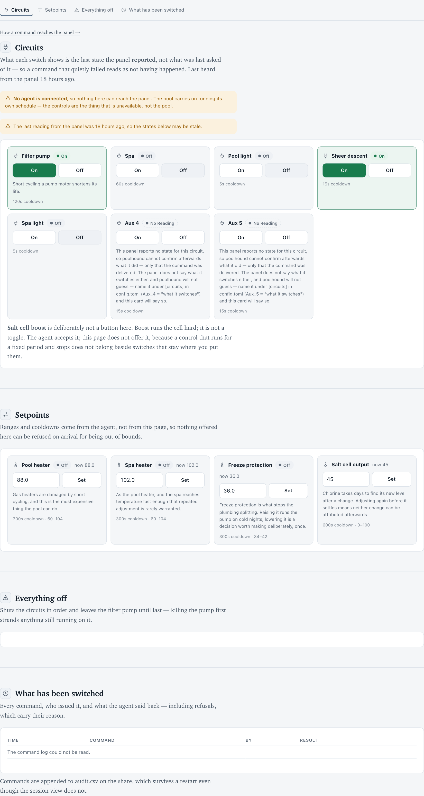
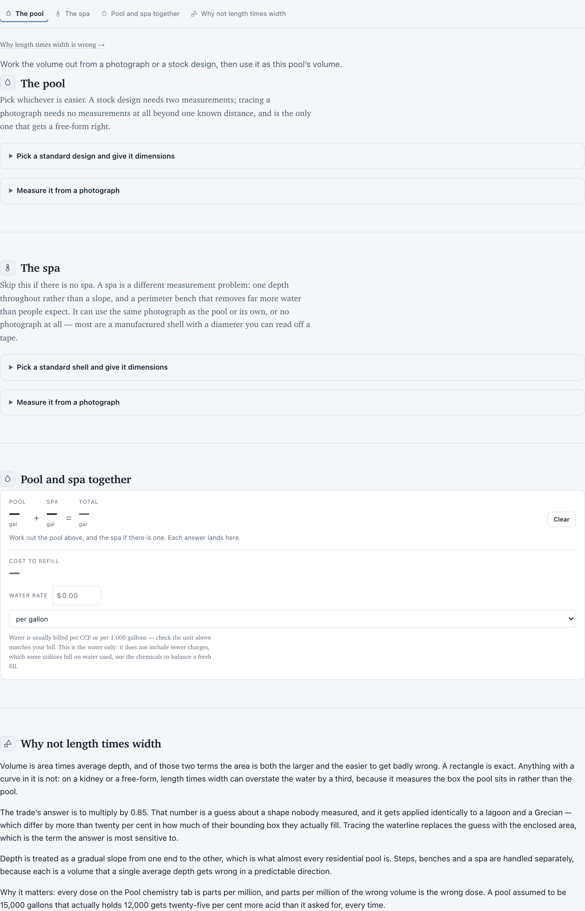

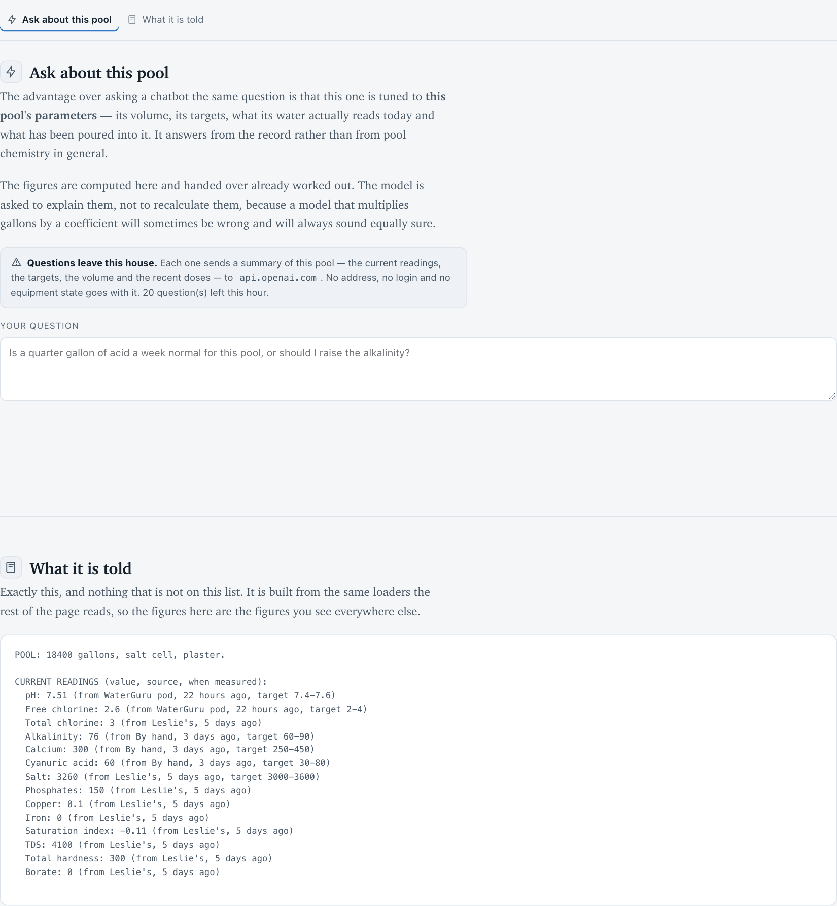
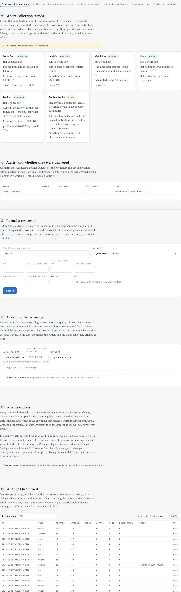
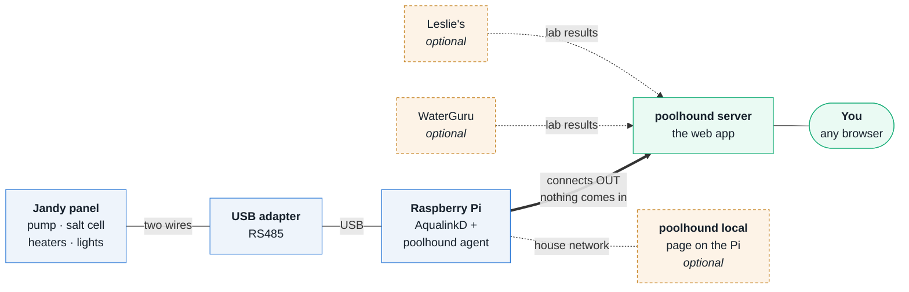
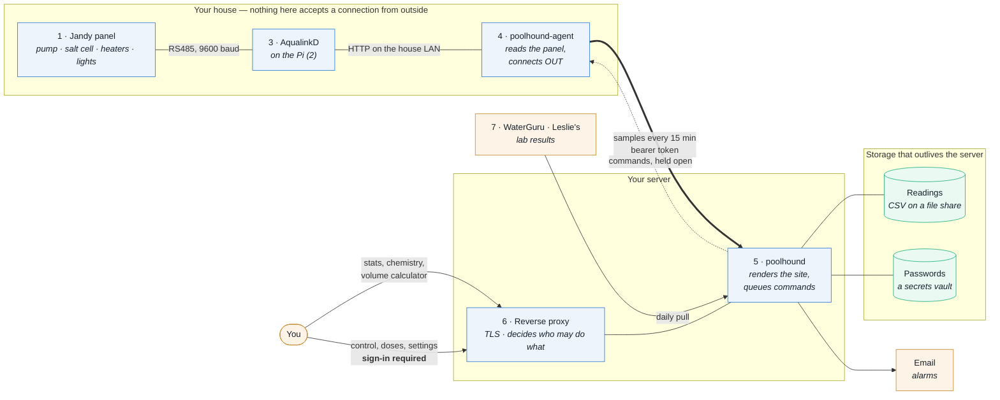
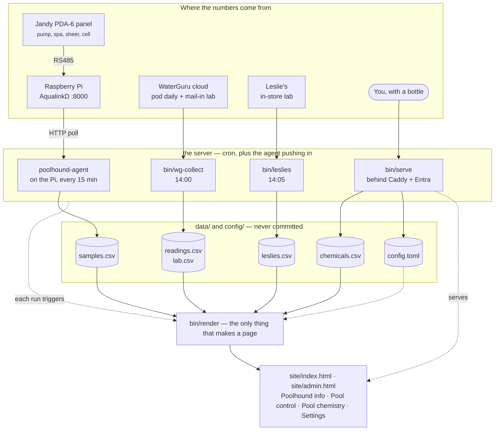

<p align="center">
  <picture>
    <source media="(prefers-color-scheme: dark)" srcset="docs/poolhound-dark.svg">
    
  </picture>
</p>

<p align="center">
  <a href="LICENSE"></a>
  
  
</p>

---

<p align="center">
  
</p>

**Three pieces.** The Jandy panel runs the pool. A Raspberry Pi wired to it
reads the panel and passes commands to it. The web server keeps the readings
and serves the site. The Pi opens every connection to the server, so nothing
on the internet can reach the pool directly. The same picture opens the
landing page; [How it fits together](#how-it-fits-together) has the rest.

## What this is

poolhound exists to solve three specific problems with running a pool.

**Reaching the controller from anywhere.** A Jandy panel running
[AqualinkD](https://github.com/sfeakes/AqualinkD) has no authentication of its
own — anything that can reach it on the network can start the spa heater. So it
can never be exposed, port-forwarded or proxied. Instead a small agent in the
house opens a connection *outward* and waits, which means nothing on the
internet can open a connection toward the pool, and there is still a control
panel on your phone.

**Dosing from what your pool actually does.** Pool chemistry advice is mostly
written for a pool that is not yours. It assumes a chlorine pool when you have a
salt cell, a fixed free-chlorine target when the correct one is a fraction of
your stabiliser, and a volume somebody guessed by multiplying length by width.
poolhound records what the controller actually did — pump hours, cell output,
heater runtime, every fifteen minutes — alongside the lab results, and reports
what moved and by how much. When you add acid it tells you afterwards what that
dose really did to your pH, rather than what a table said it should have.

**Knowing how much water there is.** Every dose figure multiplies through the
volume, so a guess there is a wrong answer everywhere else. Trace a photograph
or pick a stock design and it measures the real shape, with an uncertainty band.
That part is public and needs no sign-in: it knows nothing about any particular
pool, and there is no reason to put a login in front of arithmetic.

It is a single Python package with **no web framework, no database and six
dependencies**. Four of them exist only to talk to one vendor's API, and the
other two only so the public volume calculator can read a photograph.

### What it looks like

<p align="center">
  <picture>
    <source media="(prefers-color-scheme: dark)" srcset="docs/screenshots/home-dark.png">
    
  </picture>
</p>

**Home leads with what to do, not what the numbers are.** Each item carries the
dose computed for this pool's volume, and says which reading it rests on and how
old that reading is — a prescription from a three-week-old lab result should say
so. Items are ordered by consequence: aggressive water damages plaster
permanently, a high pH reverses the moment it is corrected.

<p align="center">
  
</p>

**Pool control shows what the panel reported, never what was asked.** A command
that quietly failed reads as not having happened. When no agent is connected the
buttons are disabled and the page says so, rather than offering a control it
cannot deliver.

It has two halves, and the prose here used to describe only the first.
**Circuits** are on or off. **Setpoints** carry a number — the pool heater, the
spa heater, freeze protection and the salt cell output — each with the panel's
own range, its own cooldown, and the value the panel reports back. "Is it
running" and "what is it set to" are different questions, and the cards answer
them separately.

<p align="center">
  
</p>

**The volume calculator is public and needs no sign-in.** Trace a photograph or
pick a stock design; it handles pool and spa separately and gives a total, with
an uncertainty band rather than a false precision.

<p align="center">
  
</p>

**Pool chemistry is the reasoning, not a glossary.** For each of the six numbers:
what pushes it, how hard, and what that means here — the CO₂ ceiling moves with
alkalinity, the chlorine target moves with stabiliser, and where the advice
conflicts it says which to do first and why.

<p align="center">
  
</p>

**Ask AI answers from the record, not from pool chemistry in general.** The
advantage over asking a chatbot the same question is that this one is handed
this pool's volume, its targets, its actual readings and the doses that have
gone in — and the screen prints everything it sends, so there is no question
about what left the house. It needs `operate`, because it spends money.

<p align="center">
  
</p>

**Collection is the answer to "is this still working".** One card per source
with when it last ran and what it returned, then every attempt in a table —
including whether an alarm that was raised actually reached somebody. A
collector that stops is indistinguishable from a calm pool on a dashboard,
which is why it gets its own screen.

<sub>Screenshots are from a synthetic demo pool — 18,400 gal, two labs that
disagree slightly, a pump that runs one block a day. Nothing in this repository,
or in these images, is real household data: `data/`, `site/` and
`config/config.toml` are never committed. Regenerate the pool and retake them
with `bin/demo-data`, which is why they exist as a command rather than as five
files somebody once made by hand — the previous set went five features stale
because retaking them was a from-scratch job every time.</sub>

### What it actually gives you

| | |
|---|---|
| **A dashboard that says what to do next** | derived from your readings and your targets, not from a generic band |
| **Free-chlorine targets that scale with your CYA** | 7.5% of cyanuric acid, because a fixed number is wrong at both ends |
| **Dose arithmetic that learned from your pool** | measured acid response here ran 1.4–1.9× the textbook figure, and the model is alkalinity-aware because of it |
| **A volume calculator anyone can use** | trace a photograph or pick a stock design; pool and spa separately, with a total |
| **Remote control that does not expose the controller** | the panel has no authentication of its own, so it is never reachable — the house connects outward instead |
| **Two labs kept apart** | WaterGuru and Leslie's disagree sometimes; that is data, not error, and averaging them destroys it |

## How it fits together

Six boxes, before any of the detail. Two of them carry the name:
**poolhound server**, the web app you reach from anywhere, and **poolhound
local**, an optional page on the Pi for whoever is at the pool.



**The panel is at the pool; the web app can be anywhere.** The only link between
them is the thick arrow, and it is drawn that way round on purpose — the Pi
opens it, so nothing needs to reach into the house. The dashed boxes are
optional. Two are where water *test results* come from, and poolhound works
without either (you can type readings in by hand, or use it purely to control
the pool). The third, **poolhound local**, is a page the Pi serves on the house
network — step 8.

Now the same thing with the parts that matter for running it:



**Read the two arrows between the house and the server together.** The thick one
is the agent pushing samples up; the dotted one is a command travelling back
down *inside that same connection the agent opened*. There is no arrow pointing
into the house, and that is the whole architecture: the panel has no
authentication of its own, so it is never made reachable — no forwarded port, no
proxy to it, no VPN onto its network.

The numbers match [the setup guide](#setting-it-up-component-by-component):

| | Component | Runs on | Set up in |
|---|---|---|---|
| 1 | The panel and its RS485 pair | at the pool | [step 1](#1-the-panel-and-the-rs485-pair) |
| 2 | Raspberry Pi | at the pool | [step 2](#2-the-raspberry-pi) |
| 3 | AqualinkD | the Pi | [step 3](#3-aqualinkd) |
| 4 | poolhound-agent | the Pi | [step 4](#4-the-poolhound-agent) |
| 5 | poolhound | your server | [step 5](#5-the-server) |
| 6 | Reverse proxy and sign-in | in front of the server | [step 6](#6-sign-in) |
| 7 | The two lab collectors | your server | [step 7](#7-lab-collectors-optional) |

Only 1–3 are specific to a Jandy panel. Stop after 5 and you have the dashboard,
the chemistry and the calculator; 6 matters only if the server faces the
internet.

**The one arrow that matters** is the dotted one. AqualinkD has no
authentication of any kind — anything that can reach it on your network can
start your heater — so nothing outside the house is ever allowed to open a
connection toward it. The agent connects *outward* and waits for commands on
that connection. There is no inbound path, no port forward and no tunnel.

Everything else follows from that. Commands are validated three times against
one shared catalogue, the server rate-limits them, and the agent refuses
anything not on the list. The confirmed state of a switch always comes from a
*reading* rather than from the fact that a command was accepted.

## Getting started

```bash
git clone https://github.com/jchirayath/poolhound && cd poolhound
python3 -m venv .venv && .venv/bin/pip install -r deploy/requirements.txt
cp config/config.example.toml config/config.toml   # then edit it
bin/serve                                          # http://127.0.0.1:8787/
```

That is enough to use the **volume calculator** and the **chemistry reference**
with no pool data at all. To start collecting:

```bash
bin/wg-collect      # WaterGuru: pod readings and mailed-in lab results
bin/leslies         # Leslie's: in-store photometer results
bin/chem acid 32 floz   # log a dose, and see what it should do
bin/render          # rebuild the page
```

Credentials go in an encrypted vault via the Settings tab — never in the repo,
never in a config file. See **[deploy/](deploy/)** for running it as a server
with sign-in and remote control.

### What you need

- **Python 3.11+** (`tomllib`, and `datetime.fromisoformat` parsing offsets)
- A **Jandy/Zodiac panel with AqualinkD** for equipment data — optional; the
  chemistry, dosing and volume tools work without one
- A **WaterGuru** account and/or **Leslie's** account for lab results — also
  optional

---

# How it is built

Turning pool chemistry from guesswork into a fitted model.

It records three things that are never normally written down together — what the
pool equipment *did*, what the water *became*, and what was *added to it* — so
the relationship between them can be measured instead of guessed.

> **[THEORY.md](THEORY.md)** — the chemistry, why it is fittable, and what each
> coefficient buys you. Read that for the *why*; this file is the *how*.
>
> **[SITE.md](SITE.md)** — how the website itself is put together: the two
> builds and the boundary between them, the tab model, the render pipeline, and
> the recipe for adding a tab.

```
~15,000 gal (estimated) · in-ground · plaster · salt cell · muriatic 31.45%
```

**Targets are computed, not configured.** Free chlorine is a fraction of
cyanuric acid, not a fixed band, and a salt pool wants lower alkalinity than a
chlorine pool because the cell pushes pH up all day. Hard-coding a target list
here would be a fourth place for it to drift — see
[Targets follow the sanitiser](#targets-follow-the-sanitiser-not-a-generic-chart).

**Pool volume is an estimate**, and every dose calculation multiplies through it,
so the pages say so wherever a number depends on it. It is also the one input the
fit can eventually correct: a logged dose with a measured response is a
measurement of the volume it went into.

## Setting it up, component by component

The quick start above is the whole thing for one machine. This section is the
other case: the full deployment, where the pool is in one place, the server is
in another, and neither trusts the network between them.

Work through it in order — each part assumes the one before it is answered.
Nothing here needs a VPN or a forwarded port; **see [Do I need a
VPN?](#do-i-need-a-vpn) for why that is deliberate rather than an omission.**

| # | Component | Where it runs | What it is for |
|---|---|---|---|
| 1 | [The panel and the RS485 pair](#1-the-panel-and-the-rs485-pair) | at the pool | the wire that carries everything |
| 2 | [The Raspberry Pi](#2-the-raspberry-pi) | at the pool | hosts the next two |
| 3 | [AqualinkD](#3-aqualinkd) | on the Pi | turns RS485 into a local HTTP API |
| 4 | [The poolhound agent](#4-the-poolhound-agent) | on the Pi | pushes samples out, executes commands |
| 5 | [The server](#5-the-server) | anywhere | serves the pages, holds the queue |
| 6 | [Sign-in](#6-sign-in) | in front of the server | decides who may operate the pool |
| 7 | [The collectors](#7-lab-collectors-optional) | on the server | the two labs |

You can stop after any step. After 3 you have equipment data locally; after 5
you have the dashboard; 6 is only needed if the server faces the internet; **7 is
optional** — the lab accounts are one way to get water readings in, not a
requirement. Control-only is a supported setup.

---

> **The wiring detail lives in the app, not here.** The Guide tab carries the
> panel diagram, the adapter part number, the RS485 colours and the AqualinkD
> settings — written at the panel, and readable with the breaker off and no
> internet, which is where you will want them. This README gives the shape; the Guide
> gives the detail for step 1 and step 3.

### 1. The panel and the RS485 pair

Two conductors carry everything. On a Jandy panel they are the RS485 terminals
inside the enclosure, and they connect to a USB-RS485 adapter on the Pi.

> **Mains voltage is inside this enclosure.** Kill the breaker before the cover
> comes off. The RS485 pair is low voltage, but it lives next to conductors that
> are not.

- **Only the two signal conductors are used.** Power and ground on both sides
  stay where they are.
- **Polarity matters and is not labelled consistently.** If nothing appears on
  the bus, swap the two and try again — crossed leads do no damage, but +12 V
  on a signal pin destroys the adapter.
- Use a **shielded twisted pair** if the run is more than a few metres.

The **Guide tab** in the running app has the wiring diagram, the adapter part
number, and the panel-specific details — written at the panel, and readable with
the breaker off.

---

### 2. The Raspberry Pi

Any Pi with an Ethernet or Wi-Fi connection to your LAN. It needs to reach the
panel by wire and your server by HTTPS; it does **not** need to be reachable
from anywhere.

```bash
sudo apt update && sudo apt install -y python3 cron
sudo timedatectl set-timezone America/Los_Angeles   # your zone
```

The timezone matters more than it looks: AqualinkD's `sync_panel_time` writes
the Pi's clock into the panel.

> **Nothing writes to the SD card.** Two cards have already died on this board
> through write wear. The agent keeps its state in `/run`, which is tmpfs, and
> that is a constraint to preserve rather than an implementation detail —
> if you add logging to a file here, put it somewhere that is not the card.

---

### 3. AqualinkD

[AqualinkD](https://github.com/sfeakes/AqualinkD) is a separate project and does
the hard part. Install it from its own instructions, then set these in
`/etc/aqualinkd.conf` — they are the ones that are not obvious and that cost the
most time to discover:

| Setting | Value | Why |
|---|---|---|
| `panel_type` | your actual panel | the installed default is often wrong, and the wrong type mis-maps every button |
| `device_id` | `0x60` | pinned; left at `0xFF` it re-probes the bus for ~70 s on every start |
| `listen_address` | `http://0.0.0.0:8000` | the default is port 80, which collides with a web server. The directive is `listen_address`, **not** `socket_port` |
| `read_RS485_swg`, `read_RS485_ePump`, `read_RS485_vsfPump` | `yes` | sniffs devices off the bus — this is what surfaces pump RPM, watts and the salt cell |
| `button_NN_pumpID` | your pump's ID | binds the discovered pump to the filter circuit; without it the daemon finds the pump and discards its readings |
| `enable_scheduler` | `yes` | needs the `cron` package **and** a pre-existing `/etc/cron.d/aqualinkd`, which it will not create |
| `sync_panel_time` | `yes` | requires the Pi's timezone to be right |

Check it before going further:

```bash
curl http://127.0.0.1:8000/api/devices     # every circuit the panel reports
```

If that returns circuits, the hard part is done. **Do not rename the circuits in
`aqualinkd.conf`** — poolhound maps them by the panel's own names.

---

### 4. The poolhound agent

This is the piece that makes the pool reachable without exposing it. It runs on
the same Pi as AqualinkD and reaches it over the Pi's own loopback, pushes
samples **out** to the server, and holds one connection open waiting for
commands.

Reaching it over loopback is the agent's choice, not a restriction on AqualinkD:
`listen_address` above binds `0.0.0.0:8000`, so AqualinkD answers on every
interface and **anything on the house LAN can drive the pool, with no
authentication of any kind.** That is why nothing here exposes or proxies it,
and why the connection is opened outward. See *What this does not protect
against*.

```bash
sudo useradd -r -s /usr/sbin/nologin poolhound
sudo mkdir -p /opt/poolhound /etc/poolhound
sudo rsync -a --exclude .git --exclude .venv ./ /opt/poolhound/
```

That hand-rsync is the **first install only**. For every update afterwards use
`deploy/update-pi.sh`, run from a machine on the house LAN:

```bash
./deploy/update-pi.sh --check    # what revision is the Pi running?
./deploy/update-pi.sh            # back up, ship, restart, verify
```

It exists because hand-rsyncing is exactly how the agent fell three weeks behind
with nothing saying so — the fix for a hardcoded empty `pump_watts` could not
take effect because shipping it was a step somebody had to remember. `--check`
compares the Pi's `REVISION` against your checkout and exits non-zero on a
mismatch; the first run after that check was written found the agent 34 commits
behind. `PI_USER` and `PI_KEY` default to the current user and
`~/.ssh/id_ed25519`.

Generate a shared token and give it to **both** sides:

```bash
python3 -c 'import secrets; print(secrets.token_urlsafe(32))' | \
  sudo tee /etc/poolhound/agent.token
sudo chmod 600 /etc/poolhound/agent.token
sudo chown poolhound /etc/poolhound/agent.token
```

Point it at your server:

```bash
printf 'POOLHOUND_SERVER=https://pool.example.net\n' | sudo tee /etc/poolhound/agent.env
printf 'POOLHOUND_AQUALINK=http://127.0.0.1:8000\n' | sudo tee -a /etc/poolhound/agent.env
sudo chmod 600 /etc/poolhound/agent.env
```

Test once in the foreground before installing the service:

```bash
sudo -u poolhound POOLHOUND_SERVER=https://pool.example.net \
  python3 /opt/poolhound/bin/agent --once
```

Then install it. There are **three** units, not one, and `deploy/update-pi.sh`
installs all three, reloads systemd and reports whether the timer came up:

```bash
PI_HOST=<the Pi's LAN address> PI_KEY=~/.ssh/id_ed25519 ./deploy/update-pi.sh
PI_HOST=<the Pi's LAN address> PI_KEY=~/.ssh/id_ed25519 ./deploy/update-pi.sh --check
```

By hand it is:

```bash
sudo cp deploy/poolhound-agent.service \
        deploy/poolhound-agent-ensure.service \
        deploy/poolhound-agent-ensure.timer /etc/systemd/system/
sudo systemctl daemon-reload
sudo systemctl enable --now poolhound-agent poolhound-agent-ensure.timer
systemctl status poolhound-agent
```

For a long time the deploy script rsynced the source and stopped there, so
`/etc/systemd/system` held whatever had been hand-placed months earlier. **A
unit file in the tree that no deploy installs is documentation, not
configuration** — and the proof of how much that mattered is that the
ordering-cycle fix below could not have reached the Pi by running the script.

#### Three mechanisms, because "is it alive" is three questions

| Mechanism | Answers | What it caught |
|---|---|---|
| `Restart=always` | *it died* | an ordinary crash |
| `poolhound-agent-ensure.timer` | *it is not running* | a start job systemd **deleted** (below), or a service stopped by hand and forgotten |
| `WatchdogSec=120` + link staleness | *it is running and not working* | a reboot with DNS down: the agent sat `active` for eight minutes logging "stream lost; retrying" and reaching nothing |

The healer fires 2 min after boot — late enough that the boot transaction is
over — and every 5 min after. It is silent when the answer is yes and logs one
line at warning level when it had to act, because a self-healer that logs
nothing turns a fault into something that fixes itself and is never written
down. `LogLevelMax=warning` keeps systemd's own Started/Finished pair — some 600
journal records a day — off a card that has already killed two boards. **To stop
the agent deliberately you must stop the timer too**, since `inactive` cannot
tell maintenance from a fault and one that tried to guess intent would be one
that declined to heal:

```bash
sudo systemctl stop poolhound-agent-ensure.timer poolhound-agent
```

What the watchdog ping *means* is the whole design. A ping on a timer would
prove a thread is scheduled, which was never in doubt; the agent pings only
while it has had contact with the server inside `LINK_STALE_S` (600s) and
withholds it otherwise, so systemd restarts a process whose view of the network
is stuck and a fresh one re-resolves DNS. Contact includes a heartbeat, because
an idle pool is the normal case.

#### Do not order this unit behind AqualinkD

`poolhound-agent.service` used to carry `After=aqualinkd.service`. AqualinkD
ships with `After=network.target multi-user.target` while also being
`WantedBy=multi-user.target`, which puts anything behind it inside an ordering
cycle — and systemd resolves a cycle by **deleting a job**. It deleted ours. The
agent did not run for 71 hours, and the way it presents is the nasty part:
`inactive (dead)`, `Result=success`, `NRestarts=0`, no `ExecStart` in the
journal, and `systemctl is-enabled` cheerfully reporting "enabled". Two lines at
boot are the entire record:

```
multi-user.target: Found ordering cycle on poolhound-agent.service/start
multi-user.target: Job poolhound-agent.service/start deleted to break
                   ordering cycle starting with multi-user.target/start
```

`After=network-online.target` only, now. The ordering was a nicety anyway — the
agent polls AqualinkD over HTTP and retries with backoff, so starting first
costs a few seconds of retries. Note that AqualinkD's own unit still has the
cycle-shaped ordering; it starts today because systemd broke the cycle at our
expense, and with us out of the chain it may pick differently.

#### The sandbox, and the one line that has to be in it

The unit is deliberately locked down — `ProtectSystem=strict`, no new
privileges, `MemoryDenyWriteExecute`, a `@system-service` syscall filter, and
`ReadWritePaths=/run/poolhound` so it cannot touch the card. The token is read
from a file rather than an `Environment=` line, because those are visible in
`systemctl show` and in `/proc` to any local user.

`RestrictAddressFamilies=AF_INET AF_INET6 AF_UNIX`, and **the AF_UNIX is
load-bearing**. `sd_notify` opens an AF_UNIX datagram socket to
`$NOTIFY_SOCKET`; shipped without it, `socket()` raised `EAFNOSUPPORT`, the
agent's deliberately non-fatal notify handler swallowed the error exactly as
designed, not one ping was ever sent, and systemd killed the process at
start+120s for being silent — every two minutes, forever, with nothing in the
journal admitting it. Two correct behaviours composing into a restart loop.
`NotifyAccess=main` is load-bearing for the same reason: its default is `none`
for every `Type` but `notify`, so the ping would be received and discarded.

A unit file cannot prove any of this and neither can a test suite. The proof is
that the timestamp **advances**, because it only moves when systemd has actually
received a datagram:

```bash
systemctl show poolhound-agent -p WatchdogTimestamp -p NRestarts
```

---

### 5. The server

Two ways, depending on whether it faces the internet.

**On one machine, no internet.** Nothing more to do:

```bash
bin/serve        # http://127.0.0.1:8787/
```

Loopback only, and the three checks in front of every write (Host, Origin and a
per-process token) are what make that safe. `POOLHOUND_BIND` accepts loopback or
`0.0.0.0` and nothing else.

**As a real server.** The container binds `0.0.0.0` but its port is
`expose`d and **never published** — those two facts have to be read together.
Everything reaches it through a reverse proxy that terminates TLS and enforces
sign-in.

```bash
cp deploy/server.env.example deploy/server.env   # then fill it in
./deploy/bootstrap-server.sh                    # builds the host from nothing
./deploy/bootstrap-server.sh --check            # is any of it actually working
```

The agent token goes here too, at `/etc/poolhound/agent.token` (or wherever
`POOLHOUND_AGENT_TOKEN_FILE` points), with the same value as on the Pi. An
unconfigured server **refuses** agent connections rather than accepting
unauthenticated ones.

Two things `bootstrap-server.sh` deliberately cannot do: create the data share, or
create the secret store. A script that could recreate your secrets would be a
script that contains them. See **[deploy/](deploy/)** for the full runbook.

---

### 6. Sign-in

Only needed if the server is reachable from the internet.

**poolhound does not implement authentication, deliberately.** It reads an
identity header that a proxy in front of it sets, and **refuses every write when
that header is missing** — so a proxy rule that stops matching fails closed
rather than open. Any proxy that can set one of these works:

```
X-MS-CLIENT-PRINCIPAL-NAME   # Azure Easy Auth / Entra
X-Forwarded-Email            # oauth2-proxy
X-Forwarded-User             # anything, including plain basic auth
X-Auth-Request-Email
```

Whatever that header says becomes the name recorded against every dose, every
settings change and every command in `audit.csv`. Pick something that identifies
a person.

#### Strip the headers on the way in — and then prove the strip happened

A proxy that sets an identity header must also **delete** any copy the client
supplied, on every request, or anybody can name themselves. The reference
configs do that for all five headers. But stripping on the vhost only covers the
path internet traffic takes, and for months this was the weakest boundary in the
whole system: poolhound's own source said so —

> these headers are trusted because of DOCKER NETWORK MEMBERSHIP plus Caddy
> stripping them on the one path from outside. Anything that can already open a
> socket to this container can claim to be anybody.

On the author's stack that docker bridge turned out to carry eleven sibling
containers, and neither compose file declared a `networks:` key. One HTTP
request from any of them reached `/api/health`, was believed, and was handed the
write token and `admin`.

So the proxy now presents a **shared secret of its own, after the strip block**,
and poolhound compares it with `hmac.compare_digest` *before* it reads any
identity header:

```bash
openssl rand -hex 32        # put it in deploy/server.env as POOLHOUND_PROXY_SECRET
```

```caddyfile
reverse_proxy poolhound:8787 {
    header_up -X-MS-CLIENT-PRINCIPAL-NAME     # strip all five first…
    header_up -X-Forwarded-Email
    header_up -X-Forwarded-User
    header_up -X-Auth-Request-Email
    header_up -X-Poolhound-Proxy-Auth

    header_up X-Forwarded-User {http.auth.user.id}
    # …THEN present the secret, so a client that supplied it has already had
    # it removed.
    header_up X-Poolhound-Proxy-Auth {$POOLHOUND_PROXY_SECRET}
}
```

A request that cannot prove it came through the proxy falls through to the peer
test, which is what keeps a workstation on loopback `local`.

**It is opt-in**, for the same reason the access policy is: an upgrade that began
refusing every identity header would lock the owner out of their own pool. So
the gap is made visible instead of assumed closed — `/api/health` reports
`proxy_auth`, and `deploy/bootstrap-server.sh --check` counts an unset secret as
a **failure** and prints the `openssl` line above. Network isolation is the
belt-and-braces half: a dedicated docker network with only the proxy attached.
That lives in the host's compose file, which this repository deliberately does
not carry, so it is documented rather than done.

#### Option A — a username and password, no identity provider

The simplest thing that works, and it needs nothing beyond Caddy. Good for a
household, a single user, or anyone who does not want to run an IdP:

```caddyfile
pool.example.net {
    # caddy hash-password --plaintext 'your-password'
    basic_auth {
        alice $2a$14$Zc0s...replace-with-your-own-hash
    }

    reverse_proxy poolhound:8787 {
        # THIS LINE IS THE IMPORTANT ONE. Without it poolhound sees no identity
        # and refuses every write — the page loads and nothing saves.
        header_up X-Forwarded-User {http.auth.user.id}

        # Never let a client supply its own identity.
        header_up -X-MS-CLIENT-PRINCIPAL-NAME
        header_up -X-Forwarded-Email
        header_up -X-Auth-Request-Email
    }
}
```

Caddy gets and renews the TLS certificate on its own. `basic_auth` covers the
whole site, so the public half — the volume calculator and the chemistry
reference — is behind the password too; if you want those public, apply
`basic_auth` only to the private paths using the same matcher shape as the
reference config.

Verified against the running server: a request carrying
`X-Forwarded-User: alice` is admitted, its writes succeed, and they are recorded
as `alice`.

#### Option B — an identity provider

Use this if you want SSO, multiple accounts, MFA, or an audit trail your
organisation already keeps. The reference config
(`deploy/poolhound.caddy`) uses Caddy `forward_auth` to oauth2-proxy in
front of Entra, and the same shape works with Google, GitHub, Authelia or
Authentik.

Whichever you choose, the proxy config uses an **allowlist** of private paths,
not a blocklist. Be precise about what that buys, because the reference config
used to claim more than it delivers: the vhost ends with a catch-all that
proxies anything unmatched, so a route missing from the private list **is**
reachable at the proxy and is refused by poolhound itself — which issues no
session token to a caller the proxy did not vouch for, and requires `admin` for
any route `access.NEEDS` does not mention. Forgetting to list a path therefore
costs you a layer rather than opening a door. `bin/selftest` compares the vhost
against `access.NEEDS` so the omission cannot go unnoticed, and
`bootstrap-server.sh --check` compares both against the config Caddy is actually
running, which is not always the one on disk.

#### Who may do what

Your sign-in says **who** somebody is. An optional `[access]` section in
`config.toml` says **what they may do** with it:

| level | can |
|---|---|
| `view` | read the private tabs; change nothing |
| `operate` | switch equipment, log doses, record readings, correct a bad one |
| `admin` | all of that, plus settings, credentials and the export |

```toml
[access]
admins    = ["you@example.com"]
operators = ["partner@example.com"]
viewers   = ["guest@example.com"]
default   = "view"      # anyone admitted but not named
```

Addresses are matched case-insensitively against whatever your sign-in puts in
the identity header — the Settings tab shows you what that is for you.

> **Leave the section out and everyone your proxy admits is an administrator.**
> That is the historical behaviour and it is deliberate: a default-deny would
> lock you out of your own pool the first time you updated. It is the right
> answer when the proxy admits exactly your household, and the wrong one behind
> a shared sign-in or a group that can grow — so Settings says which of the two
> states your install is in rather than leaving you to find out.

The refusal happens on the server. The page also dims what a `view` account
cannot use, but that is courtesy, not the boundary — the same relationship the
two builds have with the proxy. The policy is not editable through the web UI on
purpose: a form that can grant administrator access is a form that can be used
to grant it.

With Option A (`basic_auth`) every account shares one password unless you give
people separate ones, so roles are only as good as the accounts underneath them.

---

### 7. Lab collectors, optional

**You do not need a WaterGuru pod or a Leslie's account.** They are two ways of
getting lab numbers in, and there are others. Skip this step entirely and
everything else still works:

| What you have | What you get |
|---|---|
| Nothing but the panel | Remote control, equipment history, pump and cell runtimes, the volume calculator, the chemistry reference. Every water measure reads **Unknown** with its target beside it — honestly blank rather than guessed. |
| A test kit or strips | All of the above, plus targets, doses and the "what to do next" list. Enter results on **Settings → Record a test result**; they reconcile with anything else exactly as the two labs do with each other. |
| A WaterGuru pod and/or a Leslie's account | All of the above, collected automatically once a day. |

Verified: an install with only equipment samples — no pod, no store account, no
doses — renders every tab with no errors, and the water tiles read "Unknown"
rather than inventing a number.

**Using it only to control the pool** is a legitimate setup. Do steps 1–6, skip
this one, and you have a controller you can reach from anywhere with no port
forwarded and nothing exposed. The chemistry half simply stays empty until you
give it something.

If you do have the accounts, add your logins through the **Settings** tab, which
puts them in an encrypted vault rather than a config file. Then:

```bash
bin/wg-collect      # WaterGuru: pod readings and mailed-in lab results
bin/leslies         # Leslie's: in-store photometer results
```

Schedule them with the sample cron in `deploy/poolhound-cron`. **`bin/wg-collect`
spends a real API call** — the upstream project asks for no more than one or two
a day, which is why the sample runs it once. Develop against a saved response
instead:

```bash
bin/wg-collect --from-file data/raw/wg-YYYYMMDD-HHMM.json
bin/leslies --from-file ...   # or --dry-run
```

### 8. poolhound local, optional

**poolhound local** is a page the Pi serves on the house network: friendly
circuit names, switching that checks the panel actually moved, and the agent's
list of every change at the panel and which way it came. It talks to AqualinkD
on the Pi, so it works when the internet does not — the case where the
**poolhound server** cannot help.

Nothing installs it and nothing needs it; poolhound runs the same without it. A
copy is `deploy/poolhound-local.html`. It needs the Pi's web server to proxy
`/poolapi/` to AqualinkD and, for the activity list and for naming its own
changes, `/poolactivity` and `/poolclaim` to the agent — see "Naming the door a
panel change came through" in `deploy/README.md`. It has no sign-in, like
AqualinkD itself, so it belongs on the house network and nowhere else.

---

### Do I need a VPN?

**No, and that is the point.** The pool controller has no authentication of its
own, so the design refuses to make it reachable at all — not through a forwarded
port, not through a proxy, and not through a VPN that would put it on a routable
path for anyone who gets onto that network.

Instead the agent opens **one outbound HTTPS connection** to your server and
waits on it. Nothing on the internet can open a connection toward the pool,
there is no inbound firewall rule to get wrong, and it works behind CGNAT.

You may still want a VPN or a tunnel **for your own administrative access to the
Pi** — SSH, AqualinkD's own web UI — and that is a separate decision from how
poolhound works. If you do, keep AqualinkD off any interface the VPN exposes.

The full comparison, including what happens if the server itself is compromised,
is in **[Why this is safer than exposing it or using a
VPN](#why-this-is-safer-than-exposing-it-or-using-a-vpn)**.

---

### Checking it works

```bash
curl http://127.0.0.1:8000/api/devices                 # on the Pi: AqualinkD is up
systemctl status poolhound-agent                       # on the Pi: the agent is connected
curl -s localhost:8787/api/health | python3 -m json.tool  # on the server
./deploy/bootstrap-server.sh --check                    # end to end
```

`/api/health` reports `agents` — the number of agents currently connected. If
that is `0` while the service is running, the agent cannot reach the server:
check the URL in `agent.env`, the TLS certificate, and that both ends hold the
same token.

On the page itself, the **Pool control** tab says plainly when no agent is
connected, and disables every button rather than offering controls it cannot
deliver.


## The pieces, in detail



Three things to read out of that shape:

**Everything flows one way into `data/`, and the page is derived.** No page reads
a vendor API, and no collector writes HTML. `bin/render` is the only thing that
turns data into a page, which is why every collector calls it when it finishes —
the page can never claim something the CSVs do not say.

**Nothing writes to the Raspberry Pi.** The arrow to `AqualinkD` is a read. That
board has already destroyed two SD cards through write wear.

**`bin/serve` is the only component that writes anything a human typed**, and it
is bound to loopback. It is also the only optional one: without it the site is
still generated, still served by anything, still complete — the two forms simply
become the command line.

## Why this is safer than exposing it or using a VPN

This is the design decision everything else follows from, so it is worth being
precise about — including about what it does *not* protect.

### The problem

**AqualinkD has no authentication of its own.** Not a weak password: none. It is
a local API on a trusted LAN, which is exactly the right design for what it is.
Anything that can reach it on the network can start the spa heater, run the pump
dry, or turn off freeze protection in January.

So the question is never "how do we secure the connection to it" but "how do we
avoid it ever being reachable in the first place".

### The three options, and what each actually costs

| | What you expose | If the exposed thing is compromised |
|---|---|---|
| **Forward a port** | the controller, to the internet | full pool control, immediately, by anyone |
| **VPN into the LAN** | the whole network segment, to every VPN client | the attacker is *on your home network* |
| **Outbound agent** (this) | nothing — no listening port at the house | an attacker can send commands the agent will still validate, and reach nothing else |

**Forwarding a port** is not a middle ground. An unauthenticated control API on
a routable address is found by internet-wide scanners in hours, and a
non-standard port is not a secret — it is one extra line in a scan. There is no
password to get wrong because there is no password.

**A VPN is genuinely better**, and for some jobs it is the right answer. But
look at what it grants: a VPN client is a device on your LAN. It can reach the
controller *and* everything else on that segment — the NAS, the cameras, the
printer with firmware from 2017. You are now protecting the pool with the
security of a credential on a phone that might be lost, and maintaining a second
service that has itself had critical CVEs. It also still needs an inbound path,
which is a problem behind CGNAT. A VPN moves the pool controller from "exposed
to the internet" to "exposed to everything that gets onto the VPN", which is
better but is not the same as "not exposed".

### What poolhound does instead

Nothing at the house accepts a connection. The agent opens **one outbound TLS
connection** to your server and holds it, and commands travel back down inside
it. Concretely:

- **No forwarded port, no inbound firewall rule, no listening service** reachable
  from outside. Nothing to scan, nothing to misconfigure. It works behind CGNAT.
- **The server never reaches the pool.** It cannot. It has no route to the house
  LAN and no credentials for it — it can only leave a note the agent collects.
- **The agent decides what it will do**, and it is the last word because it is the
  only check an attacker cannot skip by talking to something else. Every command
  is validated against `commands.py` on arrival, *after* the server has already
  approved it:

  | Check | Enforced |
  |---|---|
  | Shape and a well-formed id | `set`, `setpoint`, `all_off`, `resync` — nothing else |
  | Known device | 8 switches and 4 setpoints, by name. `Extra_Aux` — the solar valve — is deliberately absent, so it cannot be commanded at all |
  | Age | 300 s, so a captured command cannot be replayed later |
  | Replay | ids already executed are refused |
  | Rate | 12 commands a minute |
  | Per-device cooldown | 120 s on the filter pump, 300 s on the heaters — a compromised server cannot short-cycle a gas heater or a pump motor |

### The honest part: what happens if the server *is* compromised

Someone who takes the server can send commands, and the agent will execute the
ones that pass the checks above. They can turn your pool light on. Over time and
within the cooldowns, they could run the pump or a heater and cost you money.

What they **cannot** do is reach anything else. There is no tunnel, no route and
no credential from the server into the house. The blast radius is the set of
circuits in `commands.py`, rate-limited and cooldown-limited, and nothing
adjacent — not the LAN, not another device, not a pivot.

That bound is the actual security property, and it is why the agent revalidates
everything the server already approved. The server is treated as a peer that
might be hostile, because one day it might be.

### What this does not protect against

Said plainly, because a threat model that only lists wins is marketing:

- **Anyone on your LAN can still reach AqualinkD directly.** That is unchanged
  and unchangeable — it is what AqualinkD is. Treat your home network as the
  trust boundary it already is.
- **Anyone your proxy admits gets full pool control *unless you set `[access]`*.**
  Roles are opt-in and off by default, so an install that has never been told
  otherwise behaves exactly as it always did. See *Who may do what*.
- **The agent's token is a bearer token.** Someone who reads
  `/etc/poolhound/agent.token` off the Pi can impersonate the agent to the
  server. It is mode 600 and read by a system user, but it is a shared secret.
- **Losing the server loses remote control, and nothing else.** The pool keeps
  running its own schedule — that lives in the panel, not here.


## Why it does not run on the Pi

Nothing here writes to the Raspberry Pi. That board has already destroyed two SD
cards through write wear, and a long-running data logger is exactly the drip of
small writes that killed them. The agent that runs there holds no state: it
reads the panel, pushes the reading out, and keeps its few bytes of
idempotency state in `/run`, which is tmpfs.

Home Assistant cannot do this job either: its recorder keeps **three days** by
design, for the same reason. This needs months.

It ran on a Mac until 2026-09-12 and now runs on **the server**, with the
readings on an Azure Files share and the passwords in Azure Key Vault — so the
server holds neither, and rebuilding it loses nothing. See
[deploy/](deploy/) and `deploy/bootstrap-server.sh`.

## What is collected

| Source | Cadence | Output | Runs where |
|---|---|---|---|
| AqualinkD — controller state | every 15 min | `samples.csv` | **the Pi** — `poolhound-agent.service`, pushed out to the server |
| WaterGuru — pod + mail-in lab | daily 14:00 | `readings.csv`, `lab.csv` | the server — `/etc/cron.d/poolhound` |
| Leslie's — bench photometer | daily 14:05 | `leslies.csv` | the server — `/etc/cron.d/poolhound` |
| You — chemical additions | when you dose | `chemicals.csv` | the Chemicals tab, or `bin/chem` |
| You — corrections to a bad reading | rarely | `corrections.csv` | the Settings tab |
| *(watchdog)* | every 30 min | email | the server — `/etc/cron.d/poolhound` |

The controller sampler is the one that is not a cron job and not on the server, and
that is the whole security model rather than an accident: AqualinkD has no
authentication, so the server has no route to it and never will. The Pi reads its own
panel and pushes the reading outward.

### Why 15 minutes, not daily

The two most important predictors are **runtimes**, not readings. Pump hours
drive chlorine production *and* pH rise — through the cell and through the spa
spillover, which runs whenever the pump does. Sheer-descent hours add aeration
on top. None of these can be reconstructed from one snapshot a day; they have to
be integrated from an interval.

It also sidesteps a trap, and reveals a second one that the sentence here used
to hide. Those sensors sit in the plumbing and need flow. With the pump off
AqualinkD reports `-999` for the water temperatures, and the sampler discards
the sentinel rather than storing it as data; a single daily reading would
usually catch exactly that.

**The salt cell is the exception, and it fails the other way.** `SWG/PPM` does
not answer `-999` without flow — it keeps answering the last figure the cell
measured, bit-identical, for as long as the pump stays off. Stored, that is
indistinguishable from a fresh reading: 131 of the first 189 salt readings ever
collected were the same latched number written down again, and `by_day()`
averages the column over every row in the day. A latched value is not a wrong
reading to be corrected later, it is not a reading at all, so
`commands.drop_stale_flow_readings()` refuses it at the collector — the same
judgement the `-999` sentinel already gets, applied where the sentinel is not.

### Why WaterGuru is once a day, at 14:00

The pod measures once daily and the upstream project asks for no more than one or
two calls a day. **14:00 is chosen to sit after the 12:45 local test**, so the
reading fetched already includes that result rather than yesterday's.

`RunAtLoad` is deliberately false — reloading the job should never spend a call.

## Three measurement streams, deliberately not merged

The WaterGuru **pod** sits in the skimmer and reads free chlorine and pH in the
water every day. Everything else is **laboratory** work on a discrete sample, and
there are two labs: WaterGuru analyse a sample posted to them, Leslie's run a
bench photometer on one carried into the store.

There is a fourth, and it is the one a person authors: a test you ran yourself —
a strip, a drop kit, a reading from the pool shop — typed in on Settings and
stored in `manual.csv`. It is kept apart from the other three for the same
reason they are kept apart from each other, and ranked against them by date the
same way. Three is the number of *collectors*; four is the number of sources.

Both labs are credible, so the rule for the current value is not "trust the
better instrument" — it is simply **most recent wins, per measure**. Calcium
moves slowly and cyanuric acid barely at all, but alkalinity can shift 20 ppm in
a week on one dose of acid, so a three-week-old number is a historical fact
rather than a current one.

They live in separate files and are charted together but never averaged, because
a mean is a number neither lab measured and it buries the only question worth
asking. Comparing the two most recent results:

| Measure | WaterGuru, 14 Aug | Leslie's, 21 Aug | Reading |
|---|---|---|---|
| Cyanuric acid | 38 | 38 | steady |
| Calcium | 246 | 243 | steady |
| Salt | 3426 | 3590 | steady |
| Copper | 0.2 | 0.1 | one significant digit; same conclusion |
| **Alkalinity** | **95** | **73** | **moved, or the labs differ** |
| **Phosphates** | **238** | **21** | **moved, or the labs differ** |

That alkalinity difference is not academic. The chemistry page had been
recommending *lower the alkalinity toward 80* on the strength of the older 95.
The newer result says 73 — already inside the range a salt pool wants — so the
advice was wrong, and the page now derives it from the current measurement
instead of stating it as prose.

**Whether the pool moved or the labs differ is not decidable from the numbers.**
Seven days apart, and one dose of muriatic acid takes this pool's alkalinity down
by roughly that much — which is precisely why every dose has to be logged. The
chemical log is the only thing that can settle it.

A difference counts as real only when it is **both** proportionally large **and**
big enough in absolute terms to change what you would do. Percentage alone
reports rounding as a change: copper 0.1 against 0.2 is 50% and the same
conclusion either way.

### Lab history, as small multiples

Both labs are plotted on one timeline per measure — alkalinity, calcium, cyanuric
acid, salt, phosphates, copper — each panel on its own scale with its target band
behind the data. Alkalinity near 80 and salt near 3,500 share no axis, and forcing
them together would either flatten four series into a line at the bottom or need
a second axis, which is never the answer. Source is distinguished by mark shape,
not hue.

### Reaching Leslie's data

There is no API. `WaterTest-Landing` answers 302 to `/login` without a session
and, once authenticated, returns an empty shell — the results arrive through a
three-call XHR chain their `waterTest.js` performs, which `leslies.py`
reproduces:

```
GET  WaterTest-Home           seeds the session with the current pool
GET  WaterTest-ProfileById    -> {poolProfile: {...}}
POST WaterTest-GetSanitizer   {poolProfile, count:1} -> {name, sanitizer}
POST WaterTest-GetWaterTest   {poolProfileName, poolSanitizer} -> {response}
```

Two preconditions are easy to lose and expensive to rediscover:

- **`WaterTest-Home` is not optional.** The XHR endpoints read the current pool
  profile out of the session and that page is what puts it there. Without it they
  answer **500** — not 401, not an empty result — which reads like a server fault
  rather than a missing precondition.
- **The POST bodies are jQuery `$.param()` output**, so a nested object
  serialises as `poolProfile[pool_address][city]=…`. A flat urlencode of the same
  dict also draws a 500.

The call returns the whole history, so one run backfills. Rows are keyed on test
date, so the daily job corrects rather than duplicates and is a no-op when
nothing is new. Every fetch writes the raw fragment to `data/raw/` before parsing:
when their markup changes, the failure should be a parser that finds nothing with
the offending page on disk, not a silent gap in the history.

### Above target is not one thing

Free chlorine sat at 4.6 ppm with cyanuric acid at 38, so the derived band
(5–10% of CYA, or 1.9–3.8) called it **high** — while WaterGuru's own range for
the same pool is 1.6–5.4 and it had stopped alerting entirely. Two defensible
opinions, but a page that says "high" when the vendor says nothing reads as
broken rather than as stricter.

The real problem was putting surplus chlorine in the same voice as calcium that
is eating the plaster. There are now four states, not three:

| State | Meaning |
|---|---|
| `low` | below what the pool needs |
| `ok` | inside the band |
| `over` | more than needed, nothing going wrong — **neutral styling, no warning colour** |
| `high` | act |

For free chlorine the line between `over` and `high` is twice the target ceiling.
The safety bound is much higher — around 40% of CYA — but calling 12 ppm
"surplus" stretches the word past usefulness.

Where the reading falls between the two opinions, the tile says so outright:
*"above the 3.8 this pool needs, still inside WaterGuru's 1.6–5.4"*.

### Targets follow the sanitiser, not a generic chart

A chlorine pool wants alkalinity 80–120. **A salt pool wants it lower**, around
60–90, because the cell is a permanent upward push on pH and alkalinity is the
reservoir that feeds the rebound. Judging a salt pool against the chlorine-pool
band calls a correctly-run pool "low" and invites someone to add bicarbonate,
which is the opposite of what it needs. Where the lab states its own range —
Leslie's returns `Salt 3000-4000` alongside the results — that range is used
rather than a remembered figure.


## The web front end

```bash
bin/render          # writes site/index.html
bin/serve           # ...and serves it with the write API, on 127.0.0.1:8787
```

One page, eleven tabs, regenerated at the end of every collection run so it can
never report something the CSVs do not say. The tab is in the URL hash, so a tab
is linkable, the back button works, and a reload after saving returns you to
where you were.

The nav is in two groups: the screens that operate the pool, then the ones that
explain it. Signed in, the page opens on **Pool control**; anonymously it opens
on **Poolhound info**, which is what the public address is for.

| Tab | What it is | Public |
|---|---|:--:|
| **Pool control** | switch the circuits and set the heaters, through the agent | no |
| **Home** | **what to do next**, current state, what is running right now, trends, lab history | no |
| **Pool chemistry** | the causal reference — what raises and lowers each factor | yes |
| **Chemicals** | log a dose, with the effect estimated as you type; what has been added and what it cost, by month, for any period; and what upkeep takes, by week and by year, worked out from this pool's own record | no |
| **Collection** | every attempt to fetch anything, whether it worked, and whether an alarm was delivered | no |
| **Settings** | pool volume, credentials, notifications, chemical prices, and where the data comes from | no |
| **Ask AI** | a question answered against this pool's own record — tuned to its volume, targets and doses rather than pool chemistry in general | no |
| **Poolhound info** | the public landing page: the three-piece picture above, what this is and what it measures, with screenshots | yes |
| **Pool Volume Calculator** | any pool's volume from a photo or a stock design; pool and spa separately, with a total | yes |
| **Guide** | what each tab does, whether it is safe, the parts to buy, wiring the Jandy panel, the USB adapter and the AqualinkD settings | yes |
| **Safety & privacy** | the disclaimer; no support, except for a security report; and what the site keeps, what it sends and to whom | yes |

**Home is not public, and that is a change.** It used to be what an anonymous
visitor landed on, and nothing on it was secret — it is derived from the same
measurements the chemistry reference is. But it is a dashboard, and a dashboard
answers "how is it doing" to somebody who has not been told what "it" is. The
argument for publishing the chemistry page is that it is useful to *somebody
else's* pool, and that argument does not reach our chlorine. The masthead's
freshness line and overall verdict went with it.

### Two builds, not one page with things hidden

`bin/render` writes **two** files. `site/index.html` is the public build and
`site/admin.html` is the authenticated one. The private panels are not hidden in
the public build — they are **not in the file**, along with the script that
drives them, and the build then asserts that no house address, path, token file
or control endpoint survived into it.

This is deliberate. Client-side hiding is not a security boundary: "the tab is
not shown" is one view-source away from "here is the internal address of the pool
controller". Splitting at build time means a misconfigured proxy rule fails by
showing too little rather than too much.

### Reading is static; writing needs `bin/serve`

Everything except the two forms is generated files, and reading needs no
process. Logging a dose and changing the pool volume are writes, and the honest
options were a form that saves or no form at all — a Save button that quietly
discards input is worse than a documented command line.

So `bin/serve` runs a small loopback-only server: a handful of POSTs, a health
check, and static files. No framework, no database, no dependency.

**Loopback is not, by itself, a defence.** It is tempting to reason that a socket
on `127.0.0.1` is unreachable and therefore safe. That is true of the network and
false of the browser: any page in any tab can issue requests to `127.0.0.1`, and
they leave from inside your machine. This was not theoretical here — a POST
carrying `Origin: https://evil.example.com` wrote a fabricated dose into the
record before it was fixed.

Three layered checks close it, because each covers what the others miss:

| Check | Stops |
|---|---|
| **Host** must be a loopback name | DNS rebinding — an attacker pointing their own domain at `127.0.0.1` to become a same-origin peer |
| **Origin**, when present, must be ours | ordinary cross-site requests from a page you have open |
| **Token** on every write | anything that sends no Origin at all; minted per process, handed out only by `/api/health`, which a cross-origin page cannot read because no CORS headers are sent |

`poolhound/headers.py` owns the rest, names included: `X-Content-Type-Options`,
`X-Frame-Options: DENY`, `Referrer-Policy`, a `Permissions-Policy` that names
and denies every powerful feature rather than trusting browser defaults, and
`Cross-Origin-Opener-Policy`/`-Resource-Policy`. The Caddy vhost sends the same
set — it used to send a *different* four, with HSTS that only it can send and no
policy at all, so a Caddy-generated error page had none — and a check holds the
two together in both directions.

The **`Content-Security-Policy` permits nothing external**, so a future edit
that reaches for a CDN fails visibly rather than quietly adding a third party to
a tool that reads this household's data. It also names each page's one inline
script by **SHA-256 digest**, so there is no `script-src 'unsafe-inline'`:

- the digest is taken from **the bytes being served**, keyed on mtime and size,
  not written at render time — a render can happen in a different process from
  the one serving, and this project has a paragraph about what baking a
  build-time answer into a served page costs;
- `script-src-attr 'none'` refuses an inline event handler outright. There is
  not one in either build, and now there cannot be;
- style is split three ways: the `<style>` elements by digest in
  `style-src-elem`, `'unsafe-inline'` confined to `style-src-attr` for the
  seventy `style="…"` attributes the charts carry, and plain `style-src` last as
  the fallback for a browser that implements neither granular directive;
- **`bin/drive` reads the browser's own console back** and fails on any policy
  violation. A wrong digest refuses the page's own script, which the browser
  reports in the console and nowhere else — and the page still answers 200.

CORS preflights are refused outright. Writes are rate-limited.

The bind address is still not configurable, because the only reason to change it
would be to expose a write API to the LAN.

When it is not running the forms do not break and do not silently discard input.
They detect the missing API on load, hide the Save button, and turn into the
equivalent command line — the same code path underneath:

```
bin/chem acid 32 floz --pct 31.45
```

Saving settings **edits** `config/config.toml` in place rather than regenerating
it. That file is mostly comments explaining why each value is what it is, there
is no TOML writer in the standard library, and generating one from a dict would
throw those comments away the first time anyone saved from the browser.

### Three opinions on the target

The Settings tab shows all of them side by side: ours, derived from the chemistry
and this pool's sanitiser; WaterGuru's, published in the dashboard payload; and
Leslie's stated salt range. Only ours drives the tiles and the actions — the
others are shown so that choice is visible rather than hidden.

They mostly agree. Where they do not is worth knowing: **WaterGuru aims cyanuric
acid at 65 against a measured 38**, which is a real recommendation to add
stabiliser, and it would raise the free-chlorine target with it since that target
is a fraction of CYA.

A difference is flagged only when it is big enough in absolute terms to change an
action. A proportional test alone gets this exactly backwards — it flags pH 7.5
against 7.6, a difference nobody could dose for, while missing the CYA gap.

### One catalogue, three consumers

The CLI, the reference page's dose table and the form's live preview all need to
know what a gallon of acid does to this pool. Written three times they drift, and
the one that drifts silently is the form — it would keep answering confidently
with last month's arithmetic. So `chemicals.py` holds the catalogue and the
maths, and the browser is sent the same coefficients as JSON rather than a second
implementation. A test asserts the JSON factors reproduce the Python exactly.

It also closes the unit trap: `32 oz` is a volume for muriatic acid and a weight
for cal-hypo. Every chemical declares a phase, so the form only offers units that
mean something and `bin/chem salt 1 gal` is refused rather than quietly computed.

### What to do next

The dashboard used to report and leave the reader to do the chemistry, which is
the work this project exists to remove. The Home tab now opens with a ranked list
of actions derived from the readings and this pool's volume — each carrying the
dose, not just the observation:

```
DO THIS   Raise calcium hardness      19.3 lb of 77% calcium chloride
DO THIS   Bring pH down               1.4 qt of 31.45% muriatic acid
WATCH     Free chlorine is above target
```

**Ordering is by consequence, not by how far a number sits outside its band.**
Aggressive water dissolves plaster continuously and permanently; a high pH is a
loss of sanitiser effectiveness that reverses the moment it is corrected. Sorting
by percentage-out-of-range would put them the wrong way round.

Collector silence is an action too. Stale data looks exactly like current data on
a dashboard — a reader scanning tiles sees values, not dates — so a source that
stopped reporting is surfaced deliberately rather than left to present as a calm,
healthy pool.

### The Home tab — the dashboard (authenticated)

Tiles for the current state, then two separate trend charts (free chlorine and
pH each get their own axis — a shared one would invent crossings that mean
nothing), then the lab history as small multiples, then the part that makes this
different from a chart of readings:

**The day strip.** One row per calendar day, midnight to midnight, with a lane
each for the pump, the spa and the sheer descent, and that day's chemistry
printed at the end of the row. Cause on the left, effect on the right. A pool
reading in isolation is a number without a cause; the strip puts the twelve
hours that produced it directly beside it, so the correlation is visible before
any regression runs.

Runtime is integrated from the interval each sample *represents*, capped at 20
minutes. If the agent stopped or the Pi was unreachable, the gap stays a gap
instead of being counted as hours of pump time — which is what kept the
71-hour ordering-cycle outage from reading as three days of continuous pumping.

Each tile names the instrument behind it and how old the reading is: an accurate
number from three weeks ago is still three weeks old. The trend charts overlay
Leslie's readings on the pod's, distinguished by **mark shape** rather than hue —
a hollow diamond against a filled circle — because colour is already carrying
equipment identity elsewhere on the page and reusing the spa orange to mean
"Leslie's" would make one hue mean two things.

### The Pool chemistry tab — the causal reference

For each of the six factors: what it is, why it matters, **what raises it and
what lowers it**, each driver rated dominant / moderate / minor, with the dose
arithmetic done against this pool's own volume rather than copied from a generic
chart. Plus an interaction map of every driver against every factor, a dose
table, and the conflict this pool is actually in — chlorine effectiveness wants
pH low, the saturation index at this calcium level wants it high, and the
resolution is more calcium rather than a different pH.

Those figures are textbook starting estimates. Replacing them with this pool's
measured response is the entire point of the data collection.

### The Ask AI tab — a question answered from the record

*"I add a quarter gallon of muriatic acid every week — is that normal, or
should I raise my alkalinity?"* has an answer in the data: how much acid, how
often, what the alkalinity actually is, what this pool's pH does after a dose.
A general model knows pool chemistry in the abstract and nothing about *this*
pool. **The advantage over asking a chatbot the same question is that this one
is tuned to this pool's parameters** — its volume, its targets, what the water
actually reads today, and what has gone into it. Handed those, a language model
can explain them, which is the half it is good at.

**It is not asked to do arithmetic.** It receives figures this product has
already computed and is told, in the system prompt, not to recompute them. The
dose arithmetic lives in `chemicals.py` and nothing else reimplements it — and
a model that multiplies gallons by a coefficient is wrong at exactly the
confidence it is right at.

**What leaves the house is a fixed list**, not a serialisation:

```
POOL: 18400 gallons, salt cell, plaster.
CURRENT READINGS (value, source, when measured):
  pH: 7.51 (from WaterGuru pod, 10 hours ago, target 7.4-7.6)
  Alkalinity: 76 (from By hand, 2 days ago, target 60-90)
  ...
DOSES LOGGED (3 in total, most recent last):
  2026-09-15  acid  24 floz at 31.45%
  acid: 2 doses, about one every 20 days
```

`assistant.context()` names every field it sends. It does not iterate over
rows, because *"send a summary of the pool"* is the instruction that quietly
grows into the address. The tab prints the whole context above the form, so
what is sent is **on the screen rather than described** — and a check asserts
the site host, the Pi's address, its serial and every credential path are
absent from it, with a breaker that appends the site config the way the lazy
version of this would.

**Any OpenAI-compatible endpoint.** OpenAI, OpenRouter, Together, Azure
OpenAI — and Ollama or LM Studio on your own network, which is the
configuration where nothing leaves at all. One request shape, so the provider
is a `base_url` setting rather than a second client. `urllib`: an SDK for one
POST is not worth the image.

The key is a **vault service** like WaterGuru, Leslie's and SMTP — encrypted
store on a workstation, Key Vault on the server, set through Settings, never echoed
back. It is deliberately *not* a settable config key, and a check asserts that:
a secret in the settings map is a secret in `config.toml`, which the rest of
this product treats as a file it may print.

Three guards, for three different reasons:

| guard | why |
|---|---|
| `/api/ask` needs **`operate`**, not `view` | it spends money at a provider and sends readings out of the house, so it sits with the routes that *act* |
| the tab is **private** | the answer is about this household's pool |
| **twenty questions an hour** | a budget, not a rate limit — a page that can spend without a ceiling will, the first time a stuck key holds a button down |

The provider's error **body** is never echoed back. It can contain the request
it is complaining about, which is this pool's context, and that would land in a
page and a log; the status code is what a reader can act on.

### Interface details that are load-bearing

- **Version and build** in the footer. A generated page outlives the code that
  made it, so "which build produced this?" is a real question when something on
  it looks wrong.
- **Inline definitions** on the terms that carry weight — cyanuric acid, free
  chlorine, alkalinity. They are opaque to anyone who has not read the chemistry
  tab, and sending a reader to another tab to learn what a tile measures is a
  failure of the tile.
- **A dose can be removed.** A log you can only append to carries its own typos
  forever, and a dose that never happened is worse for the fit than a missing one
  — the model would credit a real change to it.
- **Light/dark toggle.** The CSS supported an explicit choice in both directions
  all along; without a control, half of it was unreachable.
- **Print styles**, because the printed copy is what gets carried to the shed or
  the store — and every tab prints, not just the one on screen.
- **Keyboard navigation on the tabs.** `role="tab"` is a promise that arrow keys
  work; without it the markup claims an interaction the page does not implement,
  which is worse for a screen-reader user than plain buttons would have been.

### The build refuses to ship broken scripts

`bin/render` validates every embedded JSON block and, when `node` is available,
syntax-checks every inline script before writing the file.

This is not defensive decoration. An apostrophe in *"the water's resistance"*
ended a JavaScript string literal and took the entire script with it — tabs,
forms, theme, everything — while the page still rendered and still looked correct
in a screenshot. That failure is invisible unless the console is open, which is
exactly the kind of thing a build step should catch instead of a person. The
glossary is now emitted as JSON rather than a hand-written object literal, so the
bug cannot recur in that shape either.

The script check covers every `<script>` tag, whatever attributes it carries.
It used to match only the attribute-free spelling, so a syntax error inside a
`<script type="module">` or `<script defer>` escaped the one automated gate the
project has — silently, while the JSON half raised for exactly the same
omission. A `node --check` that *times out* is also no longer swallowed as
though node were simply absent: a checker that can pass while measuring nothing
is the failure it exists to find.

### The rest of the test surface

There is no test framework — no pytest, no fixtures directory, no runner but the
one in `selftest.py`. There are commands, and every case in them is something
that was actually wrong at some point:

```bash
bin/selftest     # the pure functions, where a bug is a wrong ANSWER,
                 # plus every checks_*.py beside it — discovered, not listed
bin/render       # unfilled tokens, broken JSON and broken JS all raise
bin/contrast     # WCAG on all four palettes, and the CVD separation check
bin/drive        # both builds in a real browser, at phone width
bin/brand --check  # the committed logo against the mark brand.py draws

osv-scanner scan source --lockfile=requirements.txt:deploy/requirements.txt
```

**They run in CI now, which is where they always should have been.** Every gate
here defends a property that decays by ordinary editing — the
publishable-repository check exists because "somebody pastes a real URL into a
comment while debugging" is a normal thing to do — and until
`.github/workflows/gates.yml` existed, nothing asked between one workstation and
a deploy. The workflow runs the **documented commands** rather than restating
what checking means, because a second copy of that is the defect `seams.py`
exists for. It runs both forms of `selftest`, including `python -m`, since that
form is the Dockerfile's build gate and once passed while printing nine FAIL
lines.

Running them the way CI would, against `git archive HEAD`, found three things
true of every fresh clone and of no developer's machine: every gate needs
`config/config.toml`, which is never committed, so CI seeds it from the example
the way a first run does; `bin/contrast` needs `bin/render` to have run first,
because it asserts the *rendered* page still carries the three non-colour
fallbacks the green series colour depends on; and `bin/selftest` **failed** on a
clean tree, because the deploy inventory compared the runbook's file table
against `ls` and `deploy/server.env` is gitignored on purpose. A gate that only
passes on the machine that already has the untracked files is a gate no CI can
run.

**The first run went red, and was right to.** Six cases assumed the host ran in
the pool's timezone. Two of this product's answers are local-time answers and
cannot be anything else — `best_lab()` weighs a WaterGuru UTC instant against a
bare Leslie's local date, where 02:00Z is the previous evening here, and a dose's
canonical timestamp is written in the host's own offset — so on a UTC runner
`best_lab` returned the stale 95 ppm alkalinity where a Pacific workstation
returned the current 73. The product was correct in both; the fixtures were
reading the host's zone as the pool's. `config.DEPLOY_TZ` is now the single
place the zone is named, the container is held to it by a check, and each case
that asserts about an offset states which one. The suite passes from UTC-12 to
UTC+14 — the only way to know it is testing the code rather than the machine.

`bin/drive` exits 0 with a line when it finds no browser, which on a runner
would look exactly like a pass — so the step greps for the skip and fails on it.
`pull_request`, never `pull_request_target`: the latter runs with the base
repository's token and secrets against a fork's code. Read-only token, and no
`${{ }}` anywhere in the file, since every documented Actions injection begins
with an event field interpolated into a shell.

**The dependencies are scanned, and the deploy refuses a dirty run.** Nothing
here had ever scanned them, and the first run answered 5 packages, 53
advisories, 2 Critical and 31 High — with both 9.1s **transitive** and therefore
pinned nowhere, which is exactly how they stayed invisible. The Dockerfile
re-resolves on every build: the property that makes "rebuild from scratch" easy
makes "what did we ship" impossible to answer. `cryptography` was the one that
mattered most and was the least visible, since it encrypts the credential vault
and was a transitive of a transitive. `Pillow` and `pillow-heif` decode bytes
posted by an anonymous caller at `/api/photo`, so they are the most exposed
packages in the image. Every one of them is pinned in
`deploy/requirements.txt` now, with the reason written beside it.

Three of those cases are about the suite rather than the product, and they are
the ones that make the rest mean anything: `seams.py` asserts no fact is held in
two places, `inventory.py` compares every "this is all of them" list against
what it lists, and `checks_structure.py` breaks each detector on purpose and
asserts it goes red. A green line is evidence only if the same code can be shown
to fail.

**"Did not run" is printed, never inferred.** The deploy image carries no README,
no `deploy/` and no rendered pages, so a number of cases cannot be answered
inside it. They say so by name in a roster at the end of the run rather than returning
quietly — a distinction this suite lost twice, most recently by running under
`python -m`, where `__main__` is a second module object whose failure list
nothing appended to.

`bin/selftest` covers `pending_devices`, `newest`, `best_lab`, the volume
reconciliation, `migrate_columns`, `access`, `energy`, and `check_page` itself.
Several of its cases check the *deployment* rather than the code: that every
`SETPOINTS` range contains the values `samples.csv` actually holds (a range
that refuses the panel's own reading is wrong by construction), that a column
some collector writes is a column something reads, and that every route in
`access.NEEDS` is also gated in the Caddy vhost.

It is a regression net, not coverage. The visual half still has to be driven in
a browser — the series palette fell back to black for several commits while
every screenshot looked plausible, and a hidden button reported a successful
click.

### Design constraints worth keeping

- Palette checked with a CVD validator: `#2a78d6` pump, `#eb6834` spa,
  `#1baf7a` sheer. The green fails contrast on the light surface on its own,
  which is legal only alongside a non-colour fallback — hence the permanent
  legend, the runtime figures printed as text, and the full table view.
- Never a dual-axis chart.
- Colour tokens are defined on bare `:root` and only *redefined* for dark, so
  the common un-stamped "system theme" state renders correctly.
- Everything inline. No CDN, no font fetch, no network call at all — the pages
  work from a thumb drive.


## Three ways to get the volume

| Route | What you supply | Uncertainty |
|---|---|---|
| **Stock design** | shape from a list, length × width, two depths | ±11% |
| **Trace a photo** | outline, one measured distance, two depths | ±11% |
| **Trace a photo, camera scale** | outline, camera height, two depths | ±15% |

All three end up as a polygon and go through identical code from there — the same
long-axis detection, the same slicing, the same area-weighted depth, the same spa
handling. There is no per-shape volume formula anywhere in the project.

### Stock designs

`Settings → Pick a standard design`. Ten outlines — rectangle, Roman end, oval,
round, kidney, figure of eight, true L, lazy L, Grecian, lagoon — each stored as
a **polygon in a unit box**, not a formula. Scaling one by your two dimensions
produces the same kind of outline the tracing tool produces.

The percentage under each thumbnail is how much of its bounding box the shape
fills. That is the honest version of the trade's free-form factor, measured from
the outline instead of remembered as 0.85:

```
Rectangle 100%   Grecian 95%   Roman end 89%   Kidney 85%
Figure-8   83%   Oval    78%   L-shapes   78%   Lagoon 70%
```

### Scale, and what a photograph can actually tell you

Focal length **alone** gives no scale: a small pool close up and a large one far
away make identical pixels. But the water is a **plane**, and that changes the
problem. Given where the camera was relative to that plane, every pixel has
exactly one possible ground position — cast the ray, intersect the plane, done.

So there are two ways to scale a traced photo:

**A measured distance.** Click the two ends of anything you have put a tape on,
type the number. Most accurate, and the default.

**The camera itself.** An iPhone writes `FocalLengthIn35mmFormat`, and Apple's
MakerNote carries `AccelerationVector` — the gravity direction in device
coordinates. With the rear camera looking along the device's −Z, a level phone
reads `(0,−1,0)` and one aimed at the ground reads `(0,0,−1)`, so the downward
tilt is `asin(−gz)`. Verified against a real iPhone 15 Pro Max file, which read
`−1.0155` on z for a shot taken looking down.

That leaves **camera height above the water** as the only thing to type, and you
know roughly how high you were holding it. Height enters lengths linearly and
area squared, which is why this route carries ±15% against the tape's ±11% — a
5% height error is a 10% volume error.

It is expressed as a four-point rectification internally, so it joins the
transform path that already existed rather than becoming a second way to scale.
An angled photo can also be rectified by hand: **Rectify**, four corners of
anything known to be a rectangle on the water surface.

### Every route is checked on the answer, not the inputs

A wrong scale looks reasonable at every individual input and absurd only at the
end. A 3° camera tilt with plausible height and focal length returned **42,755
sq ft and 1.6 million gallons**, having passed every input check. A mistyped tape
distance does the same thing.

So the bound is on the result: an Olympic pool is 1,320 sq ft, and anything over
5,000 sq ft or 250 ft across is refused with the reason. Oblique views below 25°
also carry an extra uncertainty term, because the far end is only a few pixels
deep and one pixel of tracing error is worth feet on the ground.

### Why tracing beats length × width

Length × width × average depth is exact for a rectangle and wrong for everything
else. On a curved outline it overstated the area by **35%** in testing, and the
trade's habit of multiplying by 0.85 still left **+14%**. The shoelace formula on
a traced outline has no such error for any shape, butterfly included.

### The shape picks the weighting; the depth is a simple ramp

The floor is assumed to fall steadily from one end to the other. That is all the
depth model needs, because the *shape* supplies the rest: the outline is sliced
across its long axis and every slice contributes its own real surface area at its
own depth. A wide shallow end pulls the average down by itself.

The difference is not cosmetic. Two mirror-image butterflies — same area, same
ramp — came out **1,808 gallons apart**, because the big lobe sat at a different
end. A flat midpoint average calls both 5.00 ft.

The outline is measured, classified and the classification is shown, never
applied silently:

| Shape | Detected by | Depth handling |
|---|---|---|
| simple | near-convex, solidity > 0.92 | ramp along the long axis |
| free-form | indented, solidity < 0.92 | ramp, with area measured per slice |
| two-lobed | a neck under 72% of the narrower lobe | ramp, or two basins if you ask |
| compact | elongation < 1.6, round | one depth |

### What it costs to put the water back

A volume is the answer the tab exists for; what a refill costs is the thing
people actually want to do with it. It sits at the bottom of the totals card,
after the figure rather than beside it, and it is the one number on the page
nobody can look up for themselves.

**The rate has a unit next to it, and that is the whole design.** Nobody has a
price per gallon in front of them: a US water bill quotes per **CCF** — a
hundred cubic feet — or per 1,000 gallons. A field labelled "rate per gallon"
invites somebody to type the 4.50 off their bill and be told a 20,000 gallon
refill costs $90,000, with nothing on screen looking wrong. So the unit is a
select beside the field. $5.00/1,000 gal and $0.005/gal were driven in a browser
to confirm they produce the same $100 on the same pool.

A **dash, not $0.00**, until there is both a volume and a rate: a confident zero
over an empty field is a figure somebody could believe. A rate of zero is a real
answer though — a well, or water included in a fee — so that is distinguished
from a missing one. Cents below $100 and whole dollars above, because at $4.20
the pennies are the whole figure and at $1,247 they are noise. The rate is
remembered per browser so somebody comparing two pool designs does not retype
it.

The arithmetic is `pool_shape.refill_cost`, not a line in the page script, and
`GALLONS_PER_CCF` is derived from `GALLONS_PER_CUBIC_FOOT` rather than written
as 748.052. The units travel to the browser as a JSON block the way the outlines
and the chemical catalogue already do: a CCF written as `748` in a template
string is the second copy of a conversion that has an owner, in the one place no
test reaches.

### Pool and spa are measured and stored separately

Both volumes are kept apart, and whether the total includes the spa is a
**plumbing question rather than a geometric one**: a spillover spa shares one body
of water with the pool so every dose is diluted by both, while one isolated behind
a valve is a second pool that happens to be nearby. `spa_shares_water` decides
which total the dosing uses, and because the two figures are stored separately
that decision can be changed later without re-tracing anything.

### The spa is measured separately

A spa is not a small pool: flat floor, one depth, and a bench round the wall.
That bench is most of the difference — on a 7 ft spa a 16 inch bench removes a
third of the volume, and treating it as a plain box overstates by **79%**. The
bench is entered as a *width*, which is visible, and its area comes from the
traced perimeter. Where the spa spills over, the two share one body of water, so
the total is what the chemistry uses and the split is shown.

### HEIC, which is what an iPhone actually writes

Chrome and Firefox cannot decode HEIC at all — the file simply never appears —
and the EXIF parser only understood JPEG. So the upload goes to the local server,
which converts with `sips` (shipped with macOS) and reads the EXIF with real
tools instead of a hand-rolled MakerNote walker in JavaScript. Tags survive the
conversion, `AccelerationVector` included, so tilt still comes for free.

Everything is re-encoded to JPEG at 1600px on the way back. Tracing precision is
limited by how steadily somebody clicks, not by sensor pixels, and it keeps the
round trip small — a screenshot that came back as a 3.5 MB PNG is 371 KB as a
JPEG. Because focal length in pixels derives from image width, resizing stays
self-consistent with the camera geometry.

Without the server the browser is tried directly, and if it cannot decode the
file it says so rather than failing silently.

### The spa is traced like the pool

Click around its waterline, the same as the pool — eight to twelve points is
plenty. An earlier version took two clicks, centre and edge, on the assumption
that every spa is round. Plenty are not: octagonal, square, or a spillover lobe
shaped to match the pool. Forcing those into a circle threw away real area.

It is still traced by hand rather than detected. On a real satellite image of a
pool with a spa beside it the spa never became a detection candidate at all while
shrubs did, and relaxing the threshold got a shrub selected as the spa. At that
scale a pale low-saturation circle is not reliably separable from wet deck by
colour, so it is asked for rather than guessed at.

### What your doses actually did

The Pool chemistry tab pairs every logged addition with the reading that followed
it: predicted change, measured change, and the ratio between them. Until a dose is
checked against the water, every figure on that page is a textbook number applied
to an estimated volume — plausible, unverified, and wrong in whichever direction
this pool happens to differ.

The first one came in on 12 September: 0.25 gal of 31.45% muriatic predicted
−0.26 pH and measured −0.30 to −0.40, so **1.4× to 1.9× stronger than estimated**.
One dose read 2.6 hours later is not a fit, and the page says so — but it is the
first evidence the estimates have ever been checked against.

### Calculate, then adopt

Two buttons, deliberately. **Calculate the volume** works out the answer and shows
the reasoning without changing anything; **Use it as the pool volume** commits it.

They used to be one action, which meant the only way to see how a number was
arrived at was to already be using it. That is backwards for a figure every dose
calculation multiplies through — you want to read the breakdown, disagree with a
depth, and try again before anything changes.

Adopting re-locks the moment any input moves, so the number that gets saved is
always the one that was on screen when it was inspected.

### Finding the water automatically

Pool water is the one large region that is decisively blue — decking is grey,
lawn is green, shadow is dark but not blue. That is enough to segment on with no
model and nothing downloaded: threshold, group touching pixels, walk each
boundary, simplify. The spa falls out of the same pass, told apart by being small
and round rather than by colour.

**Measured against sixteen photographs pulled off Wikimedia and hand-labelled:**

| | Result |
|---|---|
| Pools found, of pools present | **7 of 7** — none missed |
| Area accuracy on a controlled scene | **367 sq ft against a true 366** |
| Images with no pool that still got an outline | **5 of 9** |

Tested again on a real satellite image of an actual backyard — the one this
project exists for — it finds the pool at high confidence with a 25-point
outline. Getting there took three fixes, each of which also improved the corpus:

- **A sunlit spa was being killed by the sky filter.** Bright turquoise reads as
  high value and modest saturation, exactly like haze. What separates them is
  green: pool water measured `rgb(185,228,232)`, a +43 green lead over red, while
  pale sky keeps red and green close.
- **Rooftop solar passed every water test** — `rgb(84,107,146)` is blue-dominant
  and well saturated. It is far darker than sunlit water, so a brightness floor
  separates them without touching a pool in shade.
- **The morphology was a net dilation**, which bridged scattered bluish shadow
  under a row of trees into one region large enough to outscore the pool itself.
  Removing specks must not also glue them together.

Those two facts are not equally important. The tool is pointed at a photo of a
pool by the person who owns it, so recall is what matters, and a false alarm on a
hillside is a picture nobody will feed it. But it does mean the result cannot be
read as *"yes, that is a pool"* — it finds blue regions and does not know what a
pool is. The outline is therefore always shown, always editable, and the page
says so.

Sky was the single biggest failure and is specifically defended against: pale
high-brightness blue is refused outright, regions running off the top of the
frame are heavily penalised, and a ripple-texture test separates water from
smooth surfaces. Before those, one test image had the sky above a fence traced as
the pool while the actual pool sat unmarked below it.

### What the page shows you afterwards

Everything the analysis worked out, not a number:

- the shape classification and **why** it was reached
- which depth model was used, and whether you overrode it
- the pool/spa split, the bench area, and what the spa would read as a plain box
- what length × width × 0.85 would have said, and by how much it differs
- where the ±11% comes from, term by term, largest first

There is a **model selector** (let the outline decide / one slope / two basins /
single depth) whose inputs swap to match, and a **reload** that brings a saved
outline back for adjustment. The photograph is not stored — it would be megabytes
of JSON — so a reload draws the outline on a plain ground, which is enough to
change depths and watch the volume move.

Saving does **not** reload the page. A reload would discard the photo and the
outline, so adjusting one depth would mean starting over.

### It is still only a prior

The fitted acid response measures volume directly — a known dose of known
strength produces a pH change inversely proportional to the water it went into.
Once enough doses are logged, that supersedes this. Stated uncertainty is
**±10–12%**, from scale (entering area squared), tracing, perspective, the
modelled floor, and the step approximations, combined in quadrature.


## Controlling the pool from outside the house

AqualinkD has **no authentication of its own**. Anything that can reach it on
the network can start the spa heater. That single fact decides the whole shape
of this: the controller is never exposed, never proxied, and never reachable
from the internet, not even behind a password — because a password in front of
it protects the page, not the panel.

Instead the Pi runs an agent (`bin/agent`) that holds one long-lived connection
**out** to the site and waits. Nothing outside can open a connection toward the
pool; the pool opens one toward the site. A tunnel was the obvious alternative
and was rejected for exactly this reason — it would make the unauthenticated
controller routable, and then the only thing between the internet and the heater
would be the tunnel's own access control.

### Why a stream rather than polling

The agent needs commands to arrive in seconds, not minutes. Polling at that
latency is expensive on a link that is idle almost all the time: a 15-second
poll is roughly **140 MB a month** to learn, nearly every time, that there is
nothing to do. One held-open SSE connection with a heartbeat is about **7 MB**
and delivers faster. The heartbeat is not decoration — it keeps the NAT mapping
alive and gives both ends something to time out against, so a link that has
silently died is noticed in seconds rather than whenever the next command
happens to be sent, which could be days.

### Three checks, and only one of them matters

A command is validated against the same shared catalogue (`commands.py`) three
times:

| Layer | Refuses |
|---|---|
| The page | draws only buttons built from the catalogue, so an unsupported control cannot be pressed |
| The server | shape, device, range, age, and a ceiling of 12 commands a minute |
| The agent | all of the above again, plus per-device cooldowns and replay of a command it already ran |

The first two are for the operator: they give an answer while the person is
still looking at the button, instead of a round trip and a silence. **Only the
agent's check protects the panel**, because it is the only one an attacker
cannot skip by talking to something else. The server's rate limit is not
redundant with the agent's — it protects the *link*, so a stuck button or a
hijacked session cannot fan unbounded traffic at the house for the agent to
drop.

The catalogue is a strict allowlist, and what it leaves out is as deliberate as
what it contains. `Extra_Aux` — the solar valve — is absent: it is actuated by
the panel's own logic and has no business being switched remotely.

`all_off` turns the circuits off and the **filter pump last**, so nothing is
left running without circulation.

### What is not lost when this breaks

The schedule lives in the panel, not here. If the agent is down, the site is
down, or the internet is out, the pool keeps running its own schedule and the
page says so plainly. What is unavailable is the remote control, not the pool.


## Knowing when a collector has stopped

Silence is the failure mode that costs the most, because it does not look like
one. Stale data reads exactly like current data on a dashboard — a reader
scanning tiles sees values, not dates — so a pull that died three weeks ago
presents as a calm, healthy pool.

`bin/watch` raises a notification when the Pi has been quiet for two hours or
WaterGuru for thirty-six, and another when a source starts reporting again. It
runs every 30 minutes from `/etc/cron.d/poolhound` **on the server**, alongside the
two pulls and the render.

**Nothing runs on a workstation, and the code enforces it.** Until 2026-09-12
all of this was launchd jobs on a Mac. Those were disabled on the day, and
removed entirely on 2026-09-20 along with the workstation's copy of the pool
history and its credential store.

A laptop that can still collect is a laptop that can write a second pool
history: the readings live on an Azure Files share mounted only on the server, so a
collector run anywhere else appends somewhere nothing serves and nothing
reconciles. Two fabricated doses reached `chemicals.csv` that way during one
review. So `bin/wg-collect`, `bin/leslies`, `bin/watch` and `bin/chem` call
`config.refuse_off_deployment()` before they do anything and exit with an
explanation when `POOLHOUND_DATA` is unset — the marker the image sets and a
checkout does not. `POOLHOUND_COLLECT_ANYWAY=1` is the deliberate way past.
The controller poller was deleted outright rather than left unused, for the
same reason.

### It watches the data, not the jobs

"Did the job run?" is the wrong question. There are three failure modes and a
scheduler can only see one of them:

| Failure | Visible to the scheduler? |
|---|---|
| The job never fired — host down, job unloaded | no |
| The job fired and failed — Pi unreachable, credentials expired, API changed | yes, as an exit code |
| The job fired and succeeded — but the pod stopped measuring | no |

All three produce one symptom: the newest row is older than it should be. So
that is the trigger. The exit code is still read, but as corroboration in the
message — "no data, *and* the sampler is reporting an error" points at a
different fix from "no data, and the job is running fine".

And a **skip is not a run.** `collect.sh` writes a row whenever it declines to
start a job because the previous one is still going, and for a while the
Collection tab measured lateness from the most recent *attempt* — so a skip
refreshed the clock while collecting nothing. When the share failed to mount,
`collect.sh` skipped every job for forty hours, 86 times, every thirty minutes,
`watch` among them, and the gap this tab exists to measure would never have
grown. Lateness is measured from the last attempt that was **not** a skip, so
that outage surfaces as `late` rather than as four green cards, and a tool that
has only ever skipped has never completed a run and says so.

Two neighbouring defects went the same way. A source that had **never run** was
counted by neither the banner nor the nav badge, because the attention set was
written out in both places and both copies had the same hole — two copies that
agree look exactly like one copy that is right; it is
`collection.NEEDS_ATTENTION` now, and a seam, so a third copy fails a gate
instead of the reader. And a skipped run wore the green "working" pill: it has
its own word and the amber pill now, while deliberately **not** counting as
needing attention, because the ordinary skip means the previous run is still
going and grading that as broken is how a status strip stops being read.

### A watchdog that did not run is not evidence of anything

If the host is not running, the collectors stop as surely as if the Pi had died,
and a watchdog that only compared timestamps would announce a fault on every
restart — which is worse than no watchdog, because an alarm that is usually
wrong gets dismissed without being read, including on the day it is right.

So the watchdog keeps **its own heartbeat**. If its previous run is also
missing, the host was not up, and the collectors are given a grace period to
catch up before anything is said. The test is self-referential and needs no
platform API: whatever stopped the watchdog stopped the collectors too. It was
written when this ran on a workstation that slept; what it now covers is a
reboot, and the one that mattered was real — the share failed to mount after
the server's first reboot since deployment and every job was skipped for forty
hours.

That outage is also the limit of this approach, stated plainly: **nothing inside
this system can report its own absence.** `bin/watch` was one of the 86 skipped
jobs, so the staleness alarm it owed arrived seventeen hours late. The answer is
not a cleverer self-test but a second pair of eyes.

### The one check that is not inside poolhound

Every alarm this product raises depends on `bin/watch` running, so none of them
can report that it did not. During those forty hours the only trace was 86 lines
in a log nobody reads and a status file — on the missing share — still saying
`exit 0` from before it started.

A **push monitor** inverts that. `bin/watch` pings an external URL on every
completed run, and the monitor alarms on the ping it did *not* get: the one shape
of check that keeps working when its subject is dead. `deploy/kuma-heartbeat.py`
creates the monitor; an HTTP check would not have helped, because the site was up
the whole time and what was dead was the thing that asks questions.

**The ping says `status=up` whatever the run found**, including a run that raised
alarms and a run that could not deliver them — the return code and the tallies
travel in the message instead. It reports that the watchdog ran, not that the
pool is fine, and conflating the two would take the monitor down every time the
chlorine was low and train somebody to ignore it. Three details follow from the
URL being a credential and the job being on a schedule: it is read from the
vault, never from `config.toml`; a failure is logged by exception *type* only,
because urllib puts the full URL into most of its messages; and the timeout is
five seconds, since a monitor noticing a late ping is the same signal as it
noticing a missing one, and bookkeeping must not wedge a cron job.

It also will not repeat itself. A state file remembers each source, a
notification is sent when the state *changes*, and a standing fault is repeated
once a day so it is not forgotten either. Recovery is announced too — otherwise
someone keeps chasing a problem that has already fixed itself.

### Every job names its interpreter absolutely

Never `#!/usr/bin/env python3`. A scheduled job resolving `python3` through
`PATH` gets whatever it inherited when it was bootstrapped, so it can work all
week and fail after a reboot. Two of the old workstation's launchd jobs were in
exactly that state — one silently broken, one working by accident — and that is
part of why none of this runs on a workstation any more.

The trap is live wherever something is scheduled, so each place answers it
outright: `collect.sh` runs every collector as the **container's** python inside
the running service, and the Pi's unit names `/usr/bin/python3` in its
`ExecStart`. `config.py` exits with the reason when it finds a Python too old
for `tomllib`, rather than leaving an import traceback in a log nobody is
reading.


### Being told when something happens

The same watchdog also raises a notification for two other classes of event.

**A heater coming on.** Gas heating is the most expensive thing this pool can do,
and a heater running when nobody asked it to shows up on a bill rather than on a
dashboard. Edges are read from the sample stream rather than from current state,
because the sampler runs every fifteen minutes and the watchdog every thirty — a
heater that came on and went off between two checks would be invisible to a poll,
and a short unexplained cycle is exactly what is worth seeing. Switching off
reports how long it ran.

**Chemistry going badly wrong**, which is deliberately not the same as being off
target. The dashboard already says when a number is outside its band; interrupting
someone should be reserved for cases where waiting until tomorrow costs something:

| Alarm | Why it will not wait |
|---|---|
| FC at or below 0.3 ppm | effectively unsanitised; algae establishes in a day |
| FC below half the CYA-derived floor | chlorine has stopped keeping up, not merely run low |
| pH ≥ 8.0 | only about a fifth of the chlorine is still active, and scale starts on the cell |
| pH ≤ 7.0 | aggressive water, taking calcium out of plaster permanently |
| Salt below 85% of the cell floor | the cell throttles or stops, which becomes a chlorine problem |
| WaterGuru reporting RED | the vendor's own most severe assessment |

An alarm that fires for ordinary drift is an alarm that gets dismissed unread,
which is why these thresholds are set by consequence rather than by distance from
target. Recovery is announced too, and a standing alarm repeats once a day.

### Logins are kept encrypted

Credentials used to be plaintext files with mode 600, created by hand with
`printf` and a `chmod`. That works and is documented — and it is also why the
SMTP credentials never got created, because the friction lands exactly when
somebody is trying to turn a feature on.

They now go in an **AES-GCM encrypted vault** at `~/.poolhound/vault.enc`,
entered through the Settings tab, with the key in the **macOS keychain**.

The key location is the whole point. Encrypting a file and leaving its key beside
it on the same disk protects against nothing — anything that can read one can
read the other — while looking like security, which is worse than an honest
plaintext file because it invites people to relax about where the file ends up.
What makes this real is that the key is held by the OS and unlocked with the
login password, so the ciphertext can sit in a backup, a Time Machine snapshot or
an accidentally synced folder without carrying its key along. That is the actual
threat model: nobody is attacking this machine's RAM, but credential files do get
backed up and copied.

**What it does not defend against** is anything running as you while the keychain
is unlocked, which includes poolhound itself. A collector that logs in at two in
the morning needs the password with no human present. That is unavoidable and the
page says so rather than glossing it.

Passwords are never echoed back — not masked, not truncated, not their length.
The page shows only whether something is stored and under which username, since
getting the account wrong is a common and confusing failure. Verified that the
value appears in neither the API response, the rendered page, nor the server log.

Existing plaintext files are imported on request and **left in place**; deleting
the only copy of a password because a new store appeared to work is not
helpfulness anyone wants.

### Where notifications go

Two channels, configured on the **Settings** tab rather than by editing TOML —
these are the switches most likely to be changed on a whim, and making that mean
remembering which key is which is how settings end up never being changed.

**Email** reaches you anywhere, which is the point and also why it is held to a
higher bar by default: a banner is free to glance past, an email competes with
everything else on a phone. `serious` sends chlorine, pH and collector failures;
`info` adds heaters coming on and everything recovering.

**Desktop** is a macOS-only path — `terminal-notifier`, falling back to
`osascript` — and so reaches nobody on the deployment, which is a Linux
container. It is kept for running the watchdog by hand on a workstation and
defaults on, which costs nothing where those binaries do not exist. On the
server, email is the channel that reaches a person, and the push monitor
described above is the one that notices when nothing reached anybody at all.

An alarm email carries the numbers, not just a headline — `Now: FC 0.1 ppm, pH
8.2, status RED` — because it is read away from the pool where "pH is high" is not
something anyone can act on.

The SMTP password is never in `config.toml` and no form on the page accepts one:
it lives in its own file, referenced by path, mode 600, exactly like the WaterGuru
and Leslie's credentials. **Gmail requires an app password**; it rejects the
account password outright, and the server's own rejection text is passed through
because it is usually the fix.

There is a **Send a test email** button, which saves the settings on screen first
and then uses them. Finding out that mail was misconfigured at the moment the
chlorine is gone is the worst possible time to find out.

Email failing does not suppress the desktop notification — verified, along with
the whole send path, against a local SMTP server.

### Two hostnames, and they are not the same hostname

`config.toml`'s `[site]` section carries two names that are easy to confuse,
because for a while they were the same key and the two readers meant opposite
things by it.

| Key | What it is | Who reads it |
|---|---|---|
| `site.host` | the **public web address** of this install — `poolhound.example.net` | `watch.site_url()`, which prefixes `https://` and appends `#home`. It is the one call to action in every alert email. |
| `site.pi_host` | the **Pi's name on the house LAN** — `poolhound-pi.local` | the Guide tab, which prints it after `ssh pi@` in the verification commands. |

Set one for the other and the failure is quiet in both directions: the Guide tells you
to `ssh` to your public web host, or every alert on your phone links to
`https://raspberrypi.local/#home`. Neither is an error anything can detect.

`site.pi_host` falls back to `site.host` when it is unset, so an existing install
renders exactly what it rendered before until the new key is added. `site.user`
and `site.serial` are the Pi's login and the USB adapter's serial number, and
like `pi_host` they appear only in the authenticated build — the public build
renders `your-pi.local`, `pi` and `XXXXXXXX` in the same places, so the sentence
around them survives instead of leaving a hole.

### `solar_valve` is not a heat measurement

The sampler records a column that AqualinkD exposes as `Extra_Aux`. On this panel
it follows the **solar valve actuator** — it says the valve is being driven, not
that any heat is being delivered. It was originally called `solar_heat`, which
invited exactly the wrong conclusion, and it is recorded only because it is free
to record.

It must never be modelled as a heat input. Water temperature is measured directly
and already carries whatever solar gain actually occurred.


## Logging what you add

Either from the Chemicals tab, or from a terminal:

```bash
bin/chem acid 32 floz              # muriatic, defaults to this pool's 31.45%
bin/chem acid 1 gal --pct 14.5     # weaker acid
bin/chem chlorine 2 gal            # liquid chlorine, defaults to 12.5%
bin/chem shock 1 lb                # cal-hypo, defaults to 73%
bin/chem salt 40 lb
bin/chem --list
bin/chem --help                    # the whole catalogue, with units per chemical
```

Each logged dose prints its estimated effect, so a typo in the units shows up as
a number that is obviously wrong rather than as a quiet row in a CSV.

**Strength is mandatory, not decorative.** Muriatic ships at 31.45% and 14.5% —
over 2× apart — and chlorine spans 10% liquid to 73% cal-hypo. Without it a
volume cannot be converted into an expected pH or FC change, and the regression
would be fitting noise.

Units are checked against the chemical's **phase**, not against a global list.
`32 oz` is a volume for muriatic acid and a weight for cal-hypo, so
`bin/chem salt 1 gal` is refused rather than quietly computed.

Time is recorded because it matters: acid needs a full turnover to mix, so a late
addition belongs to the next day's reading.

## Two cadences in one response, kept apart

The WaterGuru API returns both, and conflating them would fabricate a time series:

- **Daily, from the sensor pod** — free chlorine, pH, water temperature, skimmer flow
- **Occasional, from the labs** — TA, CH, CYA, salt, phosphates, copper, iron,
  saturation index (currently four weeks old)

Every value is stored against **the time it was measured**, never the time it was
fetched, and lab values go to their own file, written only when their measurement
timestamp is one not already recorded. Otherwise a daily cron would restate
month-old lab results as fresh observations.

## The WaterGuru API

This section is about **WaterGuru's** endpoints — somebody else's API, reached
by a collector. poolhound's own routes are the section after it.

No Docker, no Flask. The reference implementation
([bdwilson/waterguru-api](https://github.com/bdwilson/waterguru-api)) wraps this
in a container; none of that is needed for a daily cron, so
`poolhound/waterguru.py` (run through `bin/wg-collect`) speaks the same
endpoints directly:

```
Cognito SRP (email + password)   ->  IdToken
cognito-identity get_credentials ->  temporary AWS credentials
SigV4-signed POST                ->  prod-getDashboardView Lambda, us-west-2
```

Pool and client IDs are public constants from that repo. It uses **pycognito**
rather than `warrant`, which upstream depends on — warrant has been unmaintained
since 2018 and does not import on current Python.

**Every raw response is kept** in `data/raw/`, and `--from-file` re-runs the
parser against a saved one:

```bash
.venv/bin/python bin/wg-collect --from-file data/raw/wg-YYYYMMDD-HHMM.json
```

So fixing a parser never costs one of the two calls a day we are asked to respect.

## The poolhound API

The Guide points a reader here for "what is the API", and for a long time the only
section called that was WaterGuru's. These are poolhound's own routes.

There is no API key and no second authentication scheme. **Who** you are is
settled before the application sees the request — by Caddy and oauth2-proxy on
the server, or by being on the loopback interface on a workstation — and **what you
may do** is then decided by `access.NEEDS`, which is the table below. A route
that is not in `access.NEEDS` needs `admin`, so a new endpoint is shut until
somebody deliberately opens it.

Every write also passes the three checks described under *Reading is static;
writing needs `bin/serve`* — Host, Origin, and the per-process token from
`/api/health`.

| Route | Method | Needs | What it does |
|---|---|---|---|
| `/api/health` | GET | — | Version, who you are, your level, whether the agent is connected, and the write token. A public visitor is issued no token, so the page renders read-only by itself. |
| `/api/commands` | GET | `view` | The command log: what was switched, by whom, and whether the panel has agreed yet. |
| `/api/rows` | GET | `view` | One data table as JSON, for the filter-and-sort controls that would otherwise need the whole page re-rendered. |
| `/api/control` | POST | `operate` | One command for the queue, validated against `commands.py`. The agent validates it again. |
| `/api/chemical` | POST | `operate` | Log a dose. |
| `/api/chemical/edit` | POST | `operate` | Correct a logged dose **in place** — it is our record of something we did, and nothing should put a wrong amount back. |
| `/api/chemical/delete` | POST | `operate` | Remove a dose that never happened. |
| `/api/reading` | POST | `operate` | A test you ran yourself: strip, drop kit or pool shop. Lands in `manual.csv`. |
| `/api/lab-correction` | POST | `operate` | Drop or override one lab reading. Appends to `corrections.csv`; never edits the lab's own file. |
| `/api/pool-shape` | POST | `operate` | **Saves** the traced outline and the volume it implies. |
| `/api/refresh` | POST | `operate` | Run a collector now. |
| `/api/ask` | POST | `operate` | Put a question to the model, with the context `assistant.context()` builds. `operate` rather than `view` because it spends money and sends this pool's readings to a third party. |
| `/api/settings` | POST | `admin` | Write `config.toml`. Audited with the values, not just the key names. |
| `/api/credential` | POST | `admin` | Store or forget one login. Never reads one back. |
| `/api/credential/import` | POST | `admin` | Move the legacy mode-600 files into the encrypted store. |
| `/api/notify-test` | POST | `admin` | Send a test notification. |
| `/api/export` | GET | `admin` | The whole history as a zip. |
| `/api/export/<name>` | GET | `admin` | One file from it — the list is `server.EXPORTABLE`. |

Two POSTs are **public on purpose**, because the volume calculator is useful to
anybody with a pool and there is no reason to put a login in front of
arithmetic. Both are pure — they read nothing, write nothing and keep nothing —
and both carry their own rate limit:

| Route | Method | What it does |
|---|---|---|
| `/api/pool-shape/compute` | POST | Volume from an outline. Returns a number; stores none. |
| `/api/photo` | POST | Finds the water in a photograph. The photograph is never stored. |

`/api/pool-shape` with no suffix **saves** and stays gated. The Caddy matcher
for the public pair has no trailing wildcard for exactly that reason.

Three more belong to the agent and authenticate with a bearer token instead of
the session token, because a daemon has no page to load one from. They are the
whole of the protocol, and `docs/AGENT-PROTOCOL.md` is the reference:

| Route | Method | What it does |
|---|---|---|
| `/api/agent/commands` | GET | The long-lived outbound stream the Pi holds open. Commands travel back down it. |
| `/api/agent/sample` | POST | One controller sample. A stored sample re-renders both builds. |
| `/api/agent/ack` | POST | What the agent did with a command, and what the panel said. |


## Data

```
data/samples.csv    every 15 min   pump, rpm, watts, swg%, salt, temps,
                                   spa, sheer, lights, heaters
data/readings.csv   daily          free_cl, ph, water_temp, skimmer_flow,
                                   status, alerts  (+ measured vs fetched time)
data/lab.csv        occasional     WaterGuru lab: ta, ch, cya, salt, phosphates,
                                   copper, iron, saturation_index
data/leslies.csv    occasional     Leslie's lab: the same, plus total chlorine
                                   and an overall score, keyed on test date
data/manual.csv     manual         a test you ran yourself: strip, drop kit,
                                   pool shop. A fourth stream, never merged
data/chemicals.csv  manual         chemical, amount, unit, pct, note
data/corrections.csv on a mistake  drops and field overrides, append-only.
                                   Applied at load; the lab file is untouched
data/audit.csv      every write    who changed what, and to what value
data/wg_targets.csv on change      WaterGuru's own targets for this pool
data/pool_shape.json on save       the traced pool and spa outline — the only
                                   thing here made by hand rather than collected
data/raw/           every fetch    verbatim API responses and pages
```

`corrections.csv` and `audit.csv` are the two files that explain why the history
looks the way it does, and both are **append-only**. A bad lab reading is
corrected, never deleted: both labs return their whole history on every pull and
the collectors match on the measurement timestamp, so a row removed from a CSV is
put back by the next cron run — a fix that appears to work and undoes itself
overnight. The correction is applied by the loaders in `render.build()`, once, at
the point everything else reads from.

All of these are in the export, and `server.EXPORTABLE` is the list.

### One copy is not a copy

Everything in that list is irreplaceable — years of readings nobody can
re-measure — and all of it lived in exactly one place: one Azure Files share,
with no snapshot policy, no backup vault and no copy job. `bootstrap-server.sh`
provisioned the share and then said, accurately, *"share CREATED EMPTY — restore
the CSVs into it before starting"*, naming no source to restore **from**.

`locking.migrate_columns` does copy a file before it rewrites it, and that is
genuinely load-bearing — but it writes the `.bak` *beside* the original, on the
same share, so the one copy the code takes shares the fate of the thing it is
copying. Share soft-delete, where it is enabled, protects against deleting the
**share**; it does nothing about a bad rewrite, a wrong migration, an `rm`
inside `/mnt/poolhound`, or ransomware on the host that holds the 0600 mount
key.

```bash
bin/backup                    # 02:40 UTC in cron; safe to run by hand
```

`bin/backup` writes a dated tarball to the host's **local disk** — the one place
guaranteed to fail separately from the share — under the same per-file locks the
writers take, so a tarball cannot catch a half-written append. One lock per file
rather than a global one, because a global lock here would block collection for
the whole copy.

| | |
|---|---|
| RPO | 24 h — one nightly tarball |
| RTO | minutes — untar into the share and render |
| Retention | 30 days, pruned by the job, because a disk that fills is an outage |
| Recoverable | a corrupting write, a bad migration, a mistaken delete, the share being lost |
| **Not** recoverable | the whole VM going away with its local disk |

That last line is the honest limit, and it is why the destination is a setting:
point `POOLHOUND_BACKUP_DIR` off-box and it goes away. **A tarball rather than a
sync**, because a sync mirrors a corruption as eagerly as it mirrors a
correction, which is the failure mode this exists for. And it **refuses a
destination inside the data directory** — that configuration is the original
defect wearing the fix's clothes, and it would look like it worked.

The recovery point is graded like anything else: `bootstrap-server.sh --check`
fails when there is no tarball or the newest is over 48 h old, and the
Collection tab shows the backup as a source alongside the collectors, so a
backup that stops running is visible on the page rather than only in cron.

**The whole of `data/` is gitignored, not just `raw/`.** It is one household's
pool history and its addresses, and this repository is meant to be opened. The
CSVs did start out tracked; removing them was part of separating the code from
the data. `config/config.toml` is ignored for the same reason —
`config/config.example.toml` is the template that ships.

## Operating it

```bash
bin/serve                                     # the UI, with saving enabled
bin/render                                    # regenerate the page only

# on the server
ssh -F /tmp/poolhound-ssh.config "$SERVER_IP"          # az ssh config mints the cert
sudo docker compose -f $STACK/compose.yml logs poolhound --tail 50
sudo grep poolhound /var/log/syslog | tail            # did cron fire
./deploy/bootstrap-server.sh --check                   # is any of it actually working

# on the Pi
systemctl status poolhound-agent
journalctl -u poolhound-agent -n 50
```

Credentials are in **Azure Key Vault** on the server, read through the VM's managed
identity, and in the encrypted vault on a workstation. The legacy plaintext
files `~/.waterguru` and `~/.leslies` — two lines each, email then
password, **mode 600** — are still read if present. Never in this repo, never printed, and the collectors
refuse to run against a file others can read rather than using it anyway.

An exit code of 1 from the sampler is usually the Pi being briefly unreachable
over wifi. That is a gap in the data, and it stays a gap: runtime is integrated
from the interval each sample represents, capped at 20 minutes, so an outage
never becomes fictional pump hours.

## Repository layout

```
bin/                    thin entry points; all logic is in the package
  wg-collect            pull WaterGuru; spends one of the two calls a day
  leslies               pull Leslie's; returns the whole history, safe to re-run
  chem                  log a dose, and print the whole chemical catalogue
  render                regenerate BOTH builds
  serve                 the UI with saving enabled
  watch                 has a collector gone quiet?
  backup                copy the history OFF the share it lives on
  agent                 the Pi side; do not run it on a workstation
  selftest              the pure functions; non-zero on a failure
  contrast              WCAG on every palette; non-zero on a failure
  drive                 both builds in a real browser, at phone width
  brand                 rewrite docs/poolhound*.svg from brand.py
  demo-data             build a synthetic pool, so the pictures are not ours
  screenshots           retake docs/screenshots from it

poolhound/
  config.py             where config.toml is found, and the data/site paths
  aqualink.py           the column list for samples.csv, and nothing else —
                        the poller that used to live here was deleted with the
                        workstation it ran on
  waterguru.py          Cognito SRP -> temporary creds -> SigV4 Lambda call
  collect_wg.py         splits the daily pod readings from the lab results
  leslies.py            the login + XHR chain, and the results-table parser
  cadence.py            THE pull schedule: how often each lab is fetched, the
                        vendor floor, and whether a tick is due yet
  chemicals.py          THE catalogue: chemicals, units, phases, dose maths
  chem.py               the command-line dose log
  pool_shape.py         THE volume arithmetic: outlines, slices, ledge, spa
  templates.py          stock pool shapes, as unit outlines
  render.py             loaders, charts, the Home tab, and the page shell
  info.py               Poolhound info — the public landing page
  assistant.py          Ask — the context it sends, and the provider client
  collection.py         Collection — every fetch, and whether alerts landed
  chemistry.py          the Pool chemistry tab
  upkeep.py             what keeping it balanced takes, by week and by year
  help.py               the Guide tab: what each tab does, then the wiring
  policies.py           Safety & privacy: the disclaimer, no support, privacy
  panels.py             the Pool control, Chemicals, Settings and volume tabs
  style.py              the stylesheet, shared by every tab
  icons.py              inline SVG icons; nothing is fetched from a CDN
  commands.py           THE command vocabulary, shared by server and agent
  queue_.py             the command queue and the SSE fan-out
  agent.py              runs on the Pi: pushes samples on a heartbeat AND
                        the moment the panel changes, executes commands
  server.py             the write API and the two agent endpoints
  headers.py            THE security headers, and the per-page CSP whose
                        digests are taken from the bytes being served
  access.py             THE policy: who may do what, once sign-in says who
  audit.py              who did what, append-only, on the share
  corrections.py        overrides for readings that are wrong
  locking.py            one writer at a time; header migration lives here too
  watch.py              notices a collector has stopped, and says so
  mail.py               THE alert email: one input, text and HTML of it
  vault.py              encrypted credentials; Key Vault on the server
  selftest.py           the runner, and the checks that grew up in it
  contrast.py           the palette checker, over all four palettes
  runlog.py             every run of every tool, and how it ended
  switchlog.py          every circuit change the samples witnessed, and
                        which of them a command of ours accounts for
  brand.py              THE mark: masthead, favicon, diagrams, README

  seams.py              which module owns which fact, checked not asserted
  inventory.py          every "this is all of them" list, against what is
  checks_structure.py   the three gates above, and the meta-check that
                        proves each detector can actually go red
  checks_a11y.py        names, focus, contrast of the rendered pages
  checks_agent.py       the Pi's interlocks, and what a restart keeps
  checks_assistant.py   what Ask sends, and what it refuses to send
  checks_catalogue.py   the chemical catalogue's own invariants
  checks_charts.py      the charts, and the non-colour fallbacks
  checks_chrome.py      the masthead, nav, theme and mark
  checks_collection.py  the Collection tab and the run log behind it
  checks_gates.py       routes, roles, Caddy, and the two builds' boundary
  checks_lowsev.py      the long tail, each one a defect that shipped
  checks_mail.py        the alert email: both renderings, and no palette
  checks_photo.py       the tracer, EXIF, HEIC and what is stripped
  checks_render_data.py the loaders, against data shaped to break them
  checks_switchlog.py   who switched what, and the ways that goes wrong
  checks_upkeep.py      the acid balance, the salt trend, what follows
  checks_vault.py       the credential store, and its isolation

config/
  config.example.toml   the template that ships
  config.toml           yours; gitignored

deploy/                 the server, the Pi units, and the runbook — see deploy/README.md
docs/                   AGENT-PROTOCOL.md, the review harness, the mark,
                        and the screenshots — poolhound*.svg are OUTPUT,
                        written by bin/brand
data/                   every CSV and every raw response; gitignored
site/                   the generated pages; gitignored
.github/workflows/      the four gates, on every push — gates.yml runs the
                        documented commands rather than restating them
```

Four rules hold this shape together, and each is here because a second copy of
something already existed and the two disagreed.

- **`chemicals.py` is the only place dose arithmetic exists** — the CLI, the
  reference page and the browser all read it, and the browser is sent its
  coefficients rather than a second implementation.
- **`pool_shape.py` is the only place volume arithmetic exists** — the browser
  sends outlines and gets numbers back, so the figure on screen and the figure
  that gets saved cannot disagree.
- **`render.py` owns the loaders** (`rows`, `num`, `when`, `ago`, `targets`,
  `best_lab`, `verdict`), and every other panel imports them, so two tabs cannot
  disagree about what the current alkalinity is.
- **`commands.py` is the shared vocabulary** — the server and the agent both validate
  against it, so they cannot drift.

`access.py`, `audit.py`, `corrections.py` and `locking.py` are the same kind of
seam: one policy, one trail, one correction mechanism, one lock. Reach for the
module rather than writing the second copy.

### Checking your work

```bash
bin/selftest        # the pure functions; non-zero on a failure
bin/render          # unfilled tokens, broken JSON and broken JS all raise
bin/contrast        # WCAG on every palette; non-zero on a failure
bin/chem salt 1 gal # must be refused: gal is not a unit for a solid
bin/drive           # both builds in a real browser, at phone width
bin/brand --check   # is README's logo still the mark brand.py draws

./deploy/bootstrap-server.sh --check   # the server, end to end
./deploy/update-pi.sh --check         # what revision is the Pi running
```

`bin/selftest` is a regression net, not coverage: every case in it is one that
was actually wrong at some point — `pending_devices`, `newest`, `best_lab`,
`migrate_columns`, `access`, `energy`, and the page checker itself. The visual
half still has to be driven in a browser, because a screenshot is not enough and
reading the source is not either.


## Thanks

**[AqualinkD](https://github.com/sfeakes/AqualinkD), by Shaun Feakes and its
contributors.** The first of the three problems above is only solvable because
AqualinkD exists. It speaks the Jandy RS485 protocol to a panel that ships no
documentation for it, turns a closed serial bus into a clean local HTTP API, and
does the genuinely hard part — the reverse engineering, the timing, the
device-by-device quirks — that everything here is built on top of. poolhound
reads its `/api` and issues `PUT`s to it; every equipment reading on the
dashboard, and every circuit you can switch, arrives through it.

If you have a Jandy or Zodiac panel, go and look at it:

- the project — <https://github.com/sfeakes/AqualinkD>
- the protocol notes, which are worth reading on their own —
  <https://github.com/sfeakes/AqualinkD/blob/master/Protocol.md>
- the wiki and setup guide — <https://github.com/sfeakes/AqualinkD/wiki>

It is a separate project under its own licence, developed independently of this
one. Nothing here is endorsed by it, and any bug you find in poolhound is ours
rather than theirs.

Thanks also to **WaterGuru** and **Leslie's**, whose products produce the lab
data this reasons over — though see the note below about their APIs.


## Licence

[MIT](LICENSE). Use it, change it, ship it; keep the copyright notice.

Two things it does not cover, because a licence cannot:

**The vendor APIs are not public.** WaterGuru's Lambda endpoints and Leslie's
Commerce Cloud pages are reverse-engineered from what their own apps do, using an
account's own credentials to read that account's own data. They can change or
disappear without notice, and nothing here is endorsed by either company. Every
collector saves its raw response before parsing precisely because that day will
come.

**The chemistry is a starting point, not advice.** The dose figures are textbook
relations applied to a configured pool volume — which, for this pool, is an
estimate. Treat the first pour of anything as a probe, log it, and let the
measured response correct the number. That is the whole idea.


## Where this is going

Collection first, modelling later. The analysis needs months of varied weather
before its coefficients mean anything, and **every day not collecting is a day
that cannot be recovered** — which is why the collectors were running before any
of this was designed.

Once there is data, the fit should answer concrete questions: what SWG dial and
pump schedule hold FC at target, what an hour of sheer descent costs in pH, and
how much acid actually moves this pool by 0.1. See [THEORY.md](THEORY.md).
